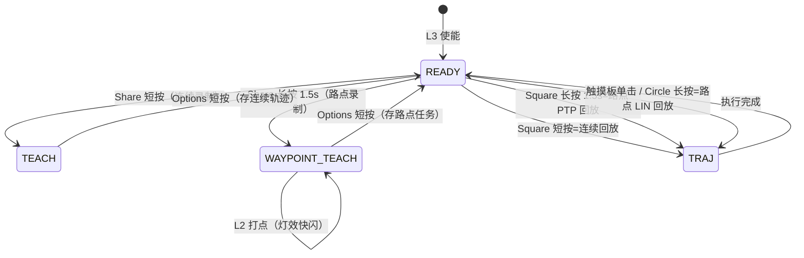

# 路点示教（Waypoint Teach）与 PTP/LIN 双模式回放 实现计划

## 一、评估结论（回答四个问题）

### 1. 其它机械臂：录几个点，还是全程录制？

两种范式并存，服务不同目的：

| 范式                 | 代表                                           | 录制内容                                                | 用途                      |
| ------------------ | -------------------------------------------- | --------------------------------------------------- | ----------------------- |
| **路点（waypoint）模式** | 工业示教器：UR PolyScope、Doosan、KUKA、ABB、FANUC、睿尔曼 | 操作员把臂拖到**几个关键位逐个确认**（典型 3\~10 个点），点间由程序生成运动         | 可重复执行的作业任务：搬运、上下料、码垛、插装 |
| **全程连续录制**         | LeRobot / ALOHA（遥操作）、Dobot 类拖动复现             | 遥操作/拖动期间**固定频率连续记录**关节流（ALOHA 标准关节 50 Hz、相机 30 fps） | 模仿学习数据集；或原样复现人手细腻动作     |

UR 官方手册明确"The Move command controls the robot's motion via waypoints"——工业程序的本体就是 Move 节点 + waypoint 列表。

**结论**：作业任务用几个路点就够；连续录制是"复刻人手动作 / 喂学习数据"的范式。本仓当前实现属于后者，新增路点模式后两者互补。

### 2. 路点之间的两种连接方式 & 哪种更常用

正是工业机器人标准的两种基本运动（命名对照）：

| 类型           | 工业命名                                           | 规划空间                               | 特点                            |
| ------------ | ---------------------------------------------- | ---------------------------------- | ----------------------------- |
| **PTP（点到点）** | UR MoveJ / Doosan MoveJ / KUKA PTP / ABB MoveJ | **关节空间**：各关节同时启动、同时到位，不约束 TCP 中间路径 | 速度快、路径不可预测（TCP 走弧线）、不受奇异点影响   |
| **LIN（直线）**  | UR MoveL / Doosan MoveL / KUKA LIN / ABB MoveL | **笛卡尔空间**：TCP 严格走直线（姿态同步约束）        | 路径可预测，但关节运动更复杂、速度较慢、近奇异点可能不可达 |

* **PTP 是默认且最常用的**。UR 培训资料原话："非直线是默认、最常用的，不是绝对必要就不用直线"。空行程（transit）几乎都走 PTP。

* LIN 只在路径必须受控时使用：接近/下探（插装、码垛对齐）、涂胶、焊接、 dispensing 等工艺段。UR MoveP（恒速+拐角圆滑）是其工艺变种。

* Doosan 的 MoveSJ/MoveSX = 一串点的连续 MoveJ/MoveL，即多点任务。

* 典型抓取程序是**混用**：PTP 到 approach 点 → LIN 直线下探抓取 → PTP 抬升转运 → LIN 放置。

### 3. 当前执行示教：MoveIt 是否重新生成完整曲线？

**轨迹本体不是。** 现状链路（基于真机栈代码核实）：

```mermaid
flowchart TD
    A[Share 短按] --> B[free-drive 零力矩<br/>joint_states 回调连续记录]
    B --> C[Options 短按<br/>5点滑动平均→落盘]
    C --> D["~/.a3/trajectories/latest.yaml<br/>+ teach_TIMESTAMP.yaml 备份"]
    E[Square 短按] --> F[/a3/arm/playback<br/>F129 立即灯效]
    F --> G{当前位姿 ≈ 首点?}
    G -->|否| H["回首点段: MoveIt OMPL 规划<br/>(playback_return_use_moveit=true, cyan)"]
    G -->|是| I[轨迹本体]
    H --> I
    I --> J["Ruckig/TOTG 重定时<br/>只改时间速度, 几何路径原样保留"]
    J --> K[FJT → 执行层]
```

* 录制：free-drive 期间 `/joint_states` 每次回调都写一条（实测 50 Hz 量级），是**全程连续**记录；保存时做 5 点中心滑动平均。

* 回放：

  1. 静态重力矩 gate（≤96 点抽样）；
  2. **仅"当前位姿→录制首点"这一段**走 move\_group（OMPL）规划，失败回落几何 ramp；
  3. **录制轨迹本体**：几何点原样保留，经 `/a3/arm/retime_trajectory`（Ruckig 加加速度受限 / TOTG）只重算时间轴与速度，然后下发。

* 即"**只重定时、不重规划路径**"。

* 真机栈 move\_group **已配置双管线**：OMPL（默认）+ **Pilz（PTP/LIN/CIRC）**，Pilz Sequence action/service 也已启用（F76），但目前除验收测试外没有业务代码调用——新增路点回放正好复用。

### 4. 按键规划（已与你确认）

* Square 短按**保留连续回放**语义，不破坏现有肌肉记忆；

* LIN 触发优先**触摸板单击**（先实测手指边沿数据），**Circle 长按兜底**；

* 用服务端**文件类型门禁**从机制上杜绝"连续轨迹被逐段慢规划"的乱套情况。

## 二、目标交互设计



| 操作        | 按键                              | 行为                                                                                 |
| --------- | ------------------------------- | ---------------------------------------------------------------------------------- |
| 连续录制开始    | **Share 短按**                    | 不变                                                                                 |
| 路点录制开始    | **Share 长按 1.5s**               | 进入 WAYPOINT\_TEACH：free-drive + 空路点表                                               |
| 路点打点      | **L2 短按**                       | 复用 save\_named\_pose 服务，服务端按状态路由：WAYPOINT\_TEACH 时只追加路点（不写 named\_poses.yaml），灯效快闪 |
| 结束并保存     | **Options 短按**                  | 服务端按当前录制模式分派                                                                       |
| 连续轨迹回放    | **Square 短按**                   | 不变                                                                                 |
| 路点 PTP 回放 | **Square 长按 1.5s**              | 逐段关节空间自动规划                                                                         |
| 路点 LIN 回放 | **触摸板单击**；兜底 **Circle 长按 1.5s** | 逐段 TCP 直线（Circle 短按仍=idle）                                                         |

**防误触机制（核心）**：

1. 文件头新增 `kind: continuous | waypoint`；旧文件无字段视为 continuous。
2. PTP/LIN 回放只接受 `kind=waypoint`，连续文件误触长按/触摸直接拒绝并返回明确提示；Square 短按遇到 waypoint 文件同样拒绝并提示改用长按。
3. 每个路点段复用 F107 静态重力矩 + 占空比门禁；Cross 长按急停、R3 软失能随时可中断。
4. 初版每段到位即停（blend=0，节奏直观可控）；拐角圆滑（Pilz Sequence blend radius）留作阶段二增强。

## 三、文件与改动

### a3\_msgs

* [PlaybackTrajectory.srv](file:///home/cat/a3_arm_ws/src/a3_msgs/srv/PlaybackTrajectory.srv)：新增

  * `string type` — `""`=连续槽（默认，向后兼容）/ `"waypoint"`=路点槽；

  * `string strategy` — `"ptp"` / `"lin"`（仅 type=waypoint 有效，默认 ptp）。

* 路点录制开始**复用 std\_srvs/Trigger**，服务名 `/a3/arm/start_waypoint_teach`，不新增 srv。

### a3\_arm\_controller

* [arm\_controller.py](file:///home/cat/a3_arm_ws/src/a3_arm_controller/a3_arm_controller/arm_controller.py)：

  1. 新增 `STATE_WAYPOINT_TEACH = "WAYPOINT_TEACH"`（[L84 附近](file:///home/cat/a3_arm_ws/src/a3_arm_controller/a3_arm_controller/arm_controller.py#L79-L89)）；
  2. `_start_waypoint_teach_cb`：复用 `_start_teach_cb`（[L2757](file:///home/cat/a3_arm_ws/src/a3_arm_controller/a3_arm_controller/arm_controller.py#L2757-L2787)）的 free-drive 切换主体，初始化 `self._waypoints=[]`；每项记录 `{positions(7), pose(7D：FK 位置+姿态)}` 供 LIN 使用；
  3. `_save_named_pose_cb`（[L2636](file:///home/cat/a3_arm_ws/src/a3_arm_controller/a3_arm_controller/arm_controller.py#L2636-L2681)）开头按状态路由：

     * WAYPOINT\_TEACH → `_capture_waypoint()`：追加当前位姿（最小增量去重），返回 `waypoint N captured`；

     * TEACH → 拒绝并 WARN（避免拖动时误写 named\_poses）；

     * 其他态 → 现有行为不变；
  4. `_stop_teach_cb`（[L2789](file:///home/cat/a3_arm_ws/src/a3_arm_controller/a3_arm_controller/arm_controller.py#L2789-L2836)）按状态分派：WAYPOINT\_TEACH 时退出 free-drive，路点 < `waypoint_min_count` 不保存；写 `~/.a3/trajectories/waypoints/latest.yaml` + `teach_wp_TIMESTAMP.yaml`，结构：

     ```yaml
     kind: waypoint
     joint_names: [L1_joint, ..., L7_joint]
     waypoints:
       - positions: [..7..]
         pose: {position: {x,y,z}, orientation: {x,y,z,w}}
     ```
  5. `_playback_cb`（[L2946](file:///home/cat/a3_arm_ws/src/a3_arm_controller/a3_arm_controller/arm_controller.py#L2946-L3003)）：解析 type/strategy，加 kind 双向门禁；waypoint → 新增 `_play_waypoints(path, strategy)`：

     * **PTP**：逐段调 `_moveit_move(q[:6])`（[L2340](file:///home/cat/a3_arm_ws/src/a3_arm_controller/a3_arm_controller/arm_controller.py#L2340-L2446)，OMPL 串行，random\_pose\_tour 同款模式），段间 `_dispatch_l7_linear` 同步夹爪；

     * **LIN**：逐段以 capture 时存的 FK 位姿为目标，经 **pilz 管线（planner\_id=LIN）** 构造 MotionPlanRequest（position + orientation constraints）下发；规划失败**不回落 PTP**（防止意外路径），明确报错；

     * 每段：静态力矩 gate（LIN 沿直线 N 点 IK 采样，复用现有 IK 能力）、duty 记录、段超时、中断检查。

* [arm\_controller.yaml](file:///home/cat/a3_arm_ws/src/a3_arm_controller/config/arm_controller.yaml)：新增参数
  `waypoint_min_count: 2`、`waypoint_min_capture_delta_rad: 0.01`、`waypoint_segment_timeout_s`（默认复用 moveit\_goto\_timeout\_s=15）、`waypoint_blend_radius_m: 0.0`（预留阶段二）。

### a3\_teleop\_ps4

* [default.yaml](file:///home/cat/a3_arm_ws/src/a3_teleop_ps4/config/mappings/default.yaml)（list 双义机制已由 ButtonEdgeTracker 支持）：

  * `share` → list：短按 teach\_start + 长按 1.5s teach\_start\_waypoint；

  * `square` → list：短按 playback\_latest + 长按 1.5s playback\_waypoints\_ptp；

  * `circle` → list：短按 goto idle + 长按 1.5s playback\_waypoints\_lin（兜底，始终保留）；

* [actions.py](file:///home/cat/a3_arm_ws/src/a3_teleop_ps4/a3_teleop_ps4/actions.py#L457-L470)：新增三个动作
  `teach_start_waypoint()`（Trigger 新服务）、
  `playback_waypoints_ptp()` / `playback_waypoints_lin()`（PlaybackTrajectory{type:"waypoint", strategy:"ptp"/"lin"}）；

* [action\_registry.yaml](file:///home/cat/a3_arm_ws/src/a3_teleop_ps4/config/action_registry.yaml)：注册三个 discrete 函数；

* **触摸板手势（先验证、后启用）**：

  * 数据链路已存在：[ds4\_hid\_node.py L194-198](file:///home/cat/a3_arm_ws/src/a3_teleop_ps4/a3_teleop_ps4/ds4_hid_node.py#L194-L198) 发布 `/a3/ds4/touch`（Vector3：x, y 归一化坐标，**z=fingers=按下 1/抬起 0**）；mapper 已订阅（[ps4\_mapper.py L71/L91](file:///home/cat/a3_arm_ws/src/a3_teleop_ps4/a3_teleop_ps4/ps4_mapper.py#L71-L93)），目前只用了 x/y；

  * 新增 `TouchGestureTracker`（z 边沿 + 按下时长/位移判定单击）；mapping 增加 `touch:` 配置节（gesture → fn），tap 绑定 playback\_waypoints\_lin；

  * 若实测 z 在蓝牙下不可靠：`touch:` 缺省不启用，Circle 长按照常兜底。

### 文档（按仓库规则，功能落地即时更新）

* [docs/edge/REQUIREMENTS.md](file:///home/cat/a3_arm_ws/docs/edge/REQUIREMENTS.md)：新增 **F131**（路点示教 + PTP/LIN 回放 + kind 门禁）、**F132**（触摸板单击手势，可配置开关/按键兜底）；

* [PS4\_OPERATOR\_GUIDE.md](file:///home/cat/a3_arm_ws/docs/edge/PS4_OPERATOR_GUIDE.md)：按键表 + 路点录制/回放完整流程；

* [docs/shared/TOPIC\_CONTRACT.md](file:///home/cat/a3_arm_ws/docs/shared/TOPIC_CONTRACT.md)：新服务 `/a3/arm/start_waypoint_teach`、playback 字段扩展；

* a3\_teleop\_ps4/README.md、docs 索引按需更新；验收通过后若有新踩坑按规则记 LL。

## 四、实施顺序

1. 服务端：WAYPOINT\_TEACH 状态 + start / L2 打点 / Options 停止保存（含落盘格式）；
2. PlaybackTrajectory 字段扩展 + kind 双向门禁 + **PTP 回放**（LIN 先返回未实现）；
3. 仿真栈（domain 99）验证：录制→PTP 回放、门禁拒绝路径；
4. mapper：三个新 action + registry + default.yaml 长短按绑定，仿真回归；
5. **触摸验证**：起栈后 `ros2 topic echo /a3/ds4/touch`，手指按下/抬起观察 z 边沿及坐标稳定性 → 实现 TouchGestureTracker → tap 绑 LIN；Circle 长按兜底无论如何保留；
6. **LIN 回放**（pilz LIN）实现 + 仿真验收；
7. 文档更新，待真机上电后回归。

## 五、验证

* 仿真新增 acceptance test（参照 f116 模式）：

  * Share 长按进入路点录制 → L2 打点 3 个 → Options 保存，文件 kind=waypoint 且含 pose；

  * Square 长按 PTP：逐段成功、段数=路点数−1；

  * 门禁：连续文件被 PTP/LIN 拒绝；waypoint 文件被 Square 短按拒绝；路点 < 2 不保存；

  * LIN：采样各段末端位置，偏离直线段超阈值即失败；

* ps4\_sim\_test.py 增补对应按键用例；

* 真机回归：Share 长按 → L2 打点 → Options → Square 长按(PTP)；触摸单击 / Circle 长按(LIN)；打点灯效快闪；Cross / R3 中途中断；

* YAML 配置合法性（mapper 启动 validate\_mapping）、`bash -n` 抽查脚本。

## 六、风险与处理

1. **Pilz LIN 约束严格**：目标必须是笛卡尔 pose（非关节值）、需在请求中指定 pilz 管线 → capture 时存 FK pose；规划失败不静默回落 PTP，明确报错；
2. **触摸板蓝牙可靠性未知**（旧问题 LL-052 是"触摸板点击键"收不到；但 HID 节点的 fingers/坐标是另一条数据链，需实测）→ 第 5 步先验证，Circle 长按永远兜底；
3. **L2 语义复用**：仅 WAYPOINT\_TEACH 改义；TEACH 态显式拒绝防误写；其他态行为不变；
4. **每段都停节奏慢**：安全直观，验收后阶段二再上 Pilz Sequence + blend radius 圆滑过点；
5. **真机 OMPL 规划耗时**：random\_pose\_tour 已验证逐段串行可接受；段超时复用 15s 参数。

