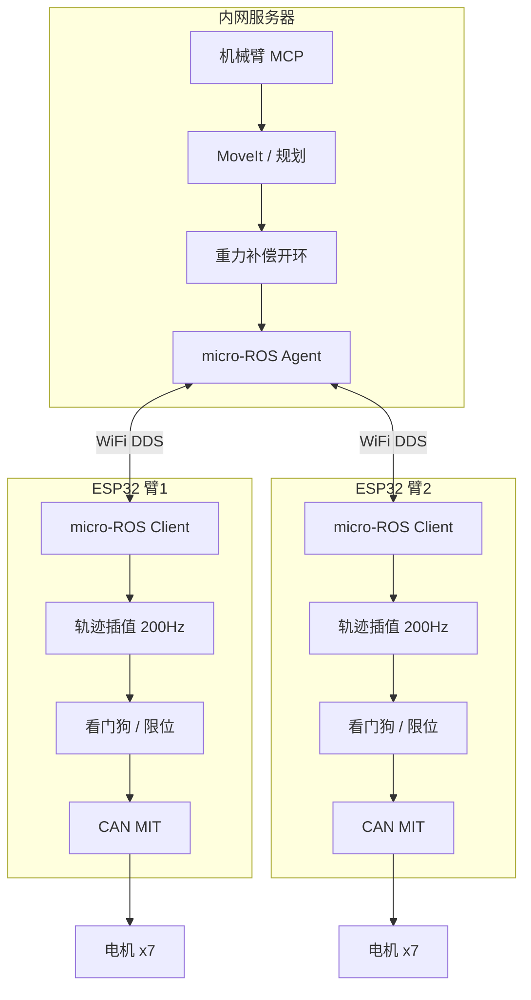
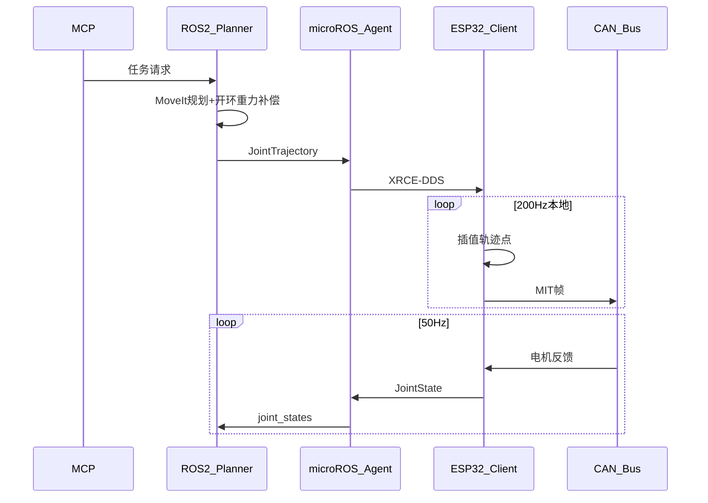
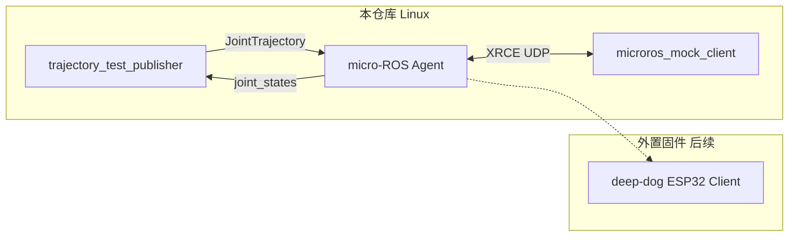

# A3 CloudEdge — 架构文档

> **Status:** draft  
> **产品线：** A3 CloudEdge（`cloud_edge`）— 云端薄边缘线（支线）

## 概述

机械臂算法集中在内网服务器，每臂通过 ESP32-S3 连接 WiFi，以 micro-ROS 接收轨迹、本地插值并以 200 Hz 发送 MIT CAN 指令。服务器通过 MCP 提供多臂高层 API。

**目标形态：** 内网服务器 + ESP32（每臂无 RK3588）。

## 组件架构



## 控制模式

| 模式 | 服务器 | ESP32 | 适用 |
|------|--------|-------|------|
| 轨迹跟踪（默认） | 下发完整 `JointTrajectory`（含 effort 开环补偿） | 时间插值 + 200 Hz CAN | 常规定位、MoveIt 路径 |
| 慢速遥操作 | 50 Hz 目标点流 | 本地平滑 + 限速 | 人工示教 |
| 边缘简化重力补偿 | 下发系数表 / lookup | `τ = f(q)` 轻量计算 | 需实时补偿但不宜云端闭环 |

**禁止：** 服务器以 200 Hz 读取 `joint_states` 并闭环下发力矩。

## 消息契约

继承 [shared/TOPIC_CONTRACT.md](../shared/TOPIC_CONTRACT.md)。多臂示例：

| 臂 | 轨迹话题 | 关节状态 | 门控 |
|----|----------|----------|------|
| arm1 | `/arm1/joint_group_effort_controller/joint_trajectory` | `/arm1/joint_states` | `/arm1/power_sequence/gate_open` |
| arm2 | `/arm2/joint_group_effort_controller/joint_trajectory` | `/arm2/joint_states` | `/arm2/power_sequence/gate_open` |

micro-ROS Agent 为每 ESP32 分配独立 ROS namespace，与 [multi_arm_config.yaml](../../src/a3_description/config/multi_arm_config.yaml) 前缀一致。

## 数据流时序



## 安全架构

详见 [shared/SAFETY.md](../shared/SAFETY.md)。CloudEdge 强制要求：

- ESP32 本地看门狗（断连 T_watchdog）
- 硬件急停 GPIO
- 本地软限位（移植 [control_gains.yaml](../../src/a3_can_bridge/config/control_gains.yaml)）
- 本地电源门控（不依赖服务器 gate 状态）

## 与 Edge 共享代码

| 资源 | Edge | CloudEdge |
|------|------|-------------|
| `a3_description` | 使用 | 服务器使用 |
| `a3_moveit_config` | 使用 | 服务器使用 |
| `a3_can_bridge` 编解码 | SocketCAN 运行时 | **移植到 ESP32 固件** |
| `a3_bringup/trajectory_bridge` | 使用 | 服务器侧可选 |
| `a3_teleop_ps4` | 板载 | 可改为网络遥操作（慢速模式） |

## 代码布局

```
src/
  a3_cloud_edge/       # Linux 端：Agent launch、mock client、测试轨迹发布
```

**ESP32-S3 固件（外置，不在本仓库）：**

- 本地：`D:\working\dev\xiaozhi-esp32\main\boards\deep-dog`
- 远程：[deep-diary/xiaozhi-esp32](https://github.com/deep-diary/xiaozhi-esp32)

开发期可用本仓库 `microros_mock_client` 替代 ESP32，经同一 Agent 验证 XRCE 链路；真机就绪后替换 Client 即可。

## Linux 链路验证架构



## 与 A3 Edge 的差异

| 项目 | A3 Edge | A3 CloudEdge |
|------|---------|--------------|
| 每臂主控 | RK3588 | ESP32-S3 |
| 规划 | 板载 | 服务器 |
| CAN | SocketCAN | ESP32 TWAI |
| 网络 | 无 | WiFi 必须 |
| 成本 | 较高 | 较低 |
| 实时闭环 | 板内最佳 | 边缘轨迹插值 |

## 关联文档

- [REQUIREMENTS.md](REQUIREMENTS.md)
- [ROADMAP.md](ROADMAP.md)
- [edge/ARCHITECTURE.md](../edge/ARCHITECTURE.md)
- [文档索引](../README.md)
