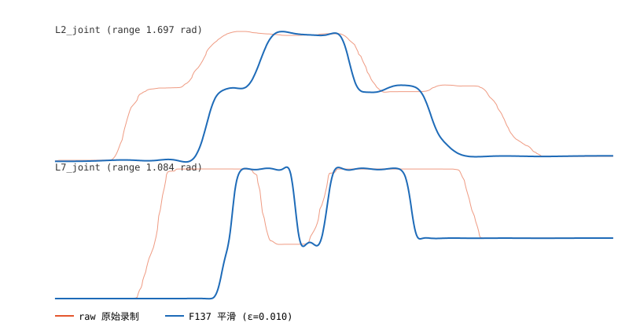

# F137 录制轨迹几何去噪 + 平滑重规划 —— 仿真对比报告

- 生成时间：2026-10-04 23:14:14
- 方法：逐关节五次 B 样条平滑（`UnivariateSpline k=5`，时间参数化，平滑因子 `s=N·ε²`）→ quintic 时间重定时
- 指标：`v_rms / a_rms / j_rms / a_peak / j_peak`（逐关节有限差分，跨关节聚合）
- 三列：`raw`=原始录制（原始时间戳）、`smooth`=F137 平滑（quintic 时间）、`standard`=首末点直线 + 同 quintic 时间（仅诊断下限，非任务路径）

## 汇总（j_rms 为主指标，越小越平滑）

| 轨迹 | n 原始 | ε (rad) | j_rms raw | j_rms smooth | j_rms standard | 降幅 | 偏离 RMS/max (rad) |
|---|---|---|---|---|---|---|---|
| teach_20261004_184429.yaml | 2780 | 0.0100 | 3.37e+04 | 10.5729 | 0.0011 | ×3187.6 | 0.0095 / 0.0597 |
| teach_20261004_184001.yaml | 3775 | 0.0100 | 8.86e+04 | 20.0347 | 0.0003 | ×4422.8 | 0.0100 / 0.0737 |
| teach_20261004_170056.yaml | 1825 | 0.0100 | 2.1e+04 | 66.5817 | 0.0019 | ×315.3 | 0.0068 / 0.0792 |

## ε 扫描（平滑强度 vs 几何偏离的 Pareto 曲线）

### teach_20261004_184429.yaml

| ε (rad) | j_rms smooth | a_rms smooth | 偏离 RMS (rad) | 偏离 max (rad) |
|---|---|---|---|---|
| 0.0050 | 23.3601 | 1.5295 | 0.0050 | 0.0289 |
| 0.0100 | 10.5729 | 1.1195 | 0.0095 | 0.0597 |
| 0.0200 | 5.9008 | 0.8082 | 0.0184 | 0.1016 |
| 0.0400 | 2.3229 | 0.5357 | 0.0331 | 0.1473 |

### teach_20261004_184001.yaml

| ε (rad) | j_rms smooth | a_rms smooth | 偏离 RMS (rad) | 偏离 max (rad) |
|---|---|---|---|---|
| 0.0050 | 40.0808 | 2.3641 | 0.0050 | 0.0440 |
| 0.0100 | 20.0347 | 1.7350 | 0.0100 | 0.0737 |
| 0.0200 | 9.6034 | 1.1744 | 0.0200 | 0.1200 |
| 0.0400 | 5.2607 | 0.8197 | 0.0396 | 0.1835 |

### teach_20261004_170056.yaml

| ε (rad) | j_rms smooth | a_rms smooth | 偏离 RMS (rad) | 偏离 max (rad) |
|---|---|---|---|---|
| 0.0050 | 117.1 | 2.5262 | 0.0038 | 0.0336 |
| 0.0100 | 66.5817 | 1.6619 | 0.0068 | 0.0792 |
| 0.0200 | 7.1485 | 0.5915 | 0.0126 | 0.1334 |
| 0.0400 | 1.7034 | 0.3825 | 0.0182 | 0.1611 |

## 分轨迹明细

### teach_20261004_184429.yaml

- 关节：L1_joint, L2_joint, L3_joint, L4_joint, L5_joint, L6_joint, L7_joint；点数 2780；时长 14.65s；ε=0.0100 rad
- 几何保持：平滑样条在原始时刻的偏离 RMS=0.0095 rad、max=0.0597 rad

| 指标 | raw | smooth | standard |
|---|---|---|---|
| v_rms | 0.3056 | 0.2367 | 0.0106 |
| a_rms | 45.6714 | 1.1195 | 0.0025 |
| j_rms | 3.37e+04 | 10.5729 | 0.0011 |
| a_peak | 1.29e+03 | 18.1101 | 0.0136 |
| j_peak | 1.49e+06 | 346.0 | 0.0095 |

### teach_20261004_184001.yaml

- 关节：L1_joint, L2_joint, L3_joint, L4_joint, L5_joint, L6_joint, L7_joint；点数 3775；时长 19.80s；ε=0.0100 rad
- 几何保持：平滑样条在原始时刻的偏离 RMS=0.0100 rad、max=0.0737 rad

| 指标 | raw | smooth | standard |
|---|---|---|---|
| v_rms | 0.4541 | 0.3183 | 0.0051 |
| a_rms | 89.0760 | 1.7350 | 0.0009 |
| j_rms | 8.86e+04 | 20.0347 | 0.0003 |
| a_peak | 8.4e+03 | 35.8873 | 0.0033 |
| j_peak | 1.32e+07 | 844.6 | 0.0017 |

### teach_20261004_170056.yaml

- 关节：L1_joint, L2_joint, L3_joint, L4_joint, L5_joint, L6_joint, L7_joint；点数 1825；时长 9.61s；ε=0.0100 rad
- 几何保持：平滑样条在原始时刻的偏离 RMS=0.0068 rad、max=0.0792 rad

| 指标 | raw | smooth | standard |
|---|---|---|---|
| v_rms | 0.1983 | 0.1486 | 0.0078 |
| a_rms | 28.5229 | 1.6619 | 0.0028 |
| j_rms | 2.1e+04 | 66.5817 | 0.0019 |
| a_peak | 1.41e+03 | 122.3 | 0.0118 |
| j_peak | 1.77e+06 | 5.72e+03 | 0.0126 |

## 结论

`smooth` 相对 `raw` 的 j_rms/a_rms 应下降 ≥ 2 个数量级（去几何量化噪声），
同时几何偏离受 ε 控制（RMS≈ε、max≈数倍 ε）。ε 越大越平滑但越偏离原始路径——
据 ε 扫描曲线在「平滑度」与「保形」之间选工作点。`standard` 仅作该时长/首末点下的平滑下限。

