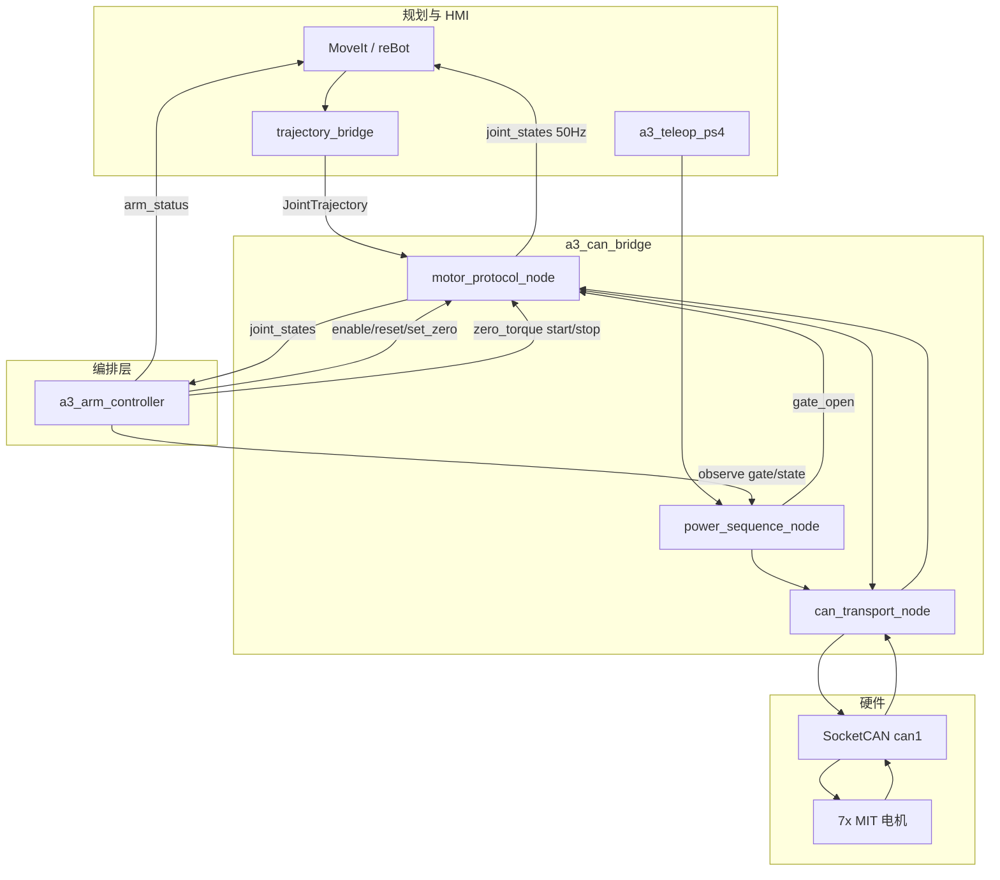

# A3 Edge — 架构文档

> **Status:** active  
> **产品线：** A3 Edge（`edge`）— 边缘全栈线（主线）

## 概述

A3 Edge 将完整 ROS 2 控制栈部署在 RK3588 板载 Linux 上，通过 SocketCAN 直接与 MIT 电机通信。轨迹规划、CAN 执行、电源序列、遥操作均在同一设备完成，追求最低板内延迟。

## 运行时分层

| 层 | 组件 | 说明 |
|----|------|------|
| 1. Platform | RK3588 SocketCAN、`can-up.service` | CAN 接口 1 Mbps 上电配置 |
| 2. Execution | `a3_can_bridge` | transport + MIT protocol + power_sequence |
| 3. Description | `a3_description`、`a3_moveit_config` | URDF、MoveIt、ros2_control |
| 4. Shell | `a3_arm_vendor` + `trajectory_bridge` | reBot 规划/遥操作话题桥接 |
| 5. HMI | `a3_teleop_ps4` | PS4 电源序列（F3）、YAML 笛卡尔 Servo + 夹爪 + 命名姿态（F16） |
| 6. Orchestration | `a3_arm_controller` | 状态机/初始化闭环/示教/状态聚合/模式仲裁/对外门面（F21） |

## 数据流



## 包依赖

| 包 | 职责 |
|----|------|
| `a3_description` | URDF、robot_state_publisher、mock hardware launch |
| `a3_moveit_config` | MoveIt 规划、demo launch |
| `a3_can_bridge` | CAN 传输、MIT 编解码、电源序列 |
| `a3_bringup` | 全栈 launch、`trajectory_bridge` |
| `a3_teleop_ps4` | PS4 遥操作（电源 F3、YAML 映射 F16） |
| `a3_arm_controller` | 机械臂编排层（生命周期/示教/状态聚合/仲裁，F21） |
| `a3_lerobot_config` | LeRobot 集成脚手架 |

### Launch 链

主入口：`ros2 launch a3_bringup a3_bringup.launch.py`

统一入口（全栈单 launch，各组件参数开关，默认全开）：

```
a3_bringup.launch.py
├── robot_state_publisher（常开）
├── can_bridge.launch.py（常开）
│   ├── can_transport_node
│   ├── motor_protocol_node
│   └── power_sequence_node（use_power_sequence，默认开）
├── trajectory_bridge（常开，reBot 话题桥接）
├── a3_arm_controller + a3_arm_monitor（use_arm_controller，默认开；arm_controller_config 可换 5J 档）
├── a3_mqtt_bridge（use_mqtt，默认开；web 遥测/指令 F18/F23）
├── move_group + follow_joint_trajectory_action（use_moveit，默认开；规划 + Execute 到执行层）
├── a3_gripper_controller（use_gripper，默认开；5J 档缺 L7 时置 false）
├── servo_mode_bridge + servo_node（use_servo，默认关；MoveIt Servo 笛卡尔 jog，与 move_group Execute 互斥）
├── ps4_teleop.launch.py（use_teleop，默认开）
├── gravity_torque_node（use_gravity_compensation，默认关）
└── rviz（use_rviz，默认关）
```

MoveIt 不 include `demo.launch.py`（自带 RSP + ros2_control + spawner，会与 can_bridge 双
/joint_states / 双 RSP 冲突）：只起 move_group，Execute 经
`follow_joint_trajectory_action` 的 `/arm_controller/follow_joint_trajectory` action 落到
`/joint_group_effort_controller/joint_trajectory` → motor_protocol_node。

仿真/专项 launch 仍独立：

```
edge_sim_wave_a.launch.py      Wave A 无 CAN 仿真（sim_executor + gravity + zero→ready）
edge_moveit_execute.launch.py  Wave B 仿真执行栈（sim_executor + FJT + IK + trajectory_bridge）
edge_teleop_sim.launch.py      PS4 遥操作仿真（Servo + mapper + sim_executor + 可选 RViz）
edge_web_sim.launch.py         Web 仿真闭环（sim_motor + arm_controller + mqtt_bridge + gripper）
servo.launch.py                MoveIt Servo 独立路径（自带 RSP + sim_executor）
urdf_dir_check.launch.py       RViz 双模型 URDF 方向校验
```

## 话题契约

详见 [shared/TOPIC_CONTRACT.md](../shared/TOPIC_CONTRACT.md)。

摘要：

- 轨迹输入：`/joint_group_effort_controller/joint_trajectory`（及桥接话题）
- 关节输出：`/joint_states`（50 Hz）
- 门控：`/power_sequence/gate_open`
- 命令：`/power_sequence/command` = `start|shutdown|set_zero`

## 控制参数

关键运行时参数（[control_gains.yaml](../../src/a3_can_bridge/config/control_gains.yaml)）：

- MIT `kp`/`kd`：80.0 / 2.0
- 最大 CAN 发送速率：200 Hz / 电机
- 关节状态反馈：50 Hz
- 电源门控：启用

## 多臂

- 配置：[multi_arm_config.yaml](../../src/a3_description/config/multi_arm_config.yaml)
- 每臂独立 CAN：`can0`..`can3`
- Launch：`multi_arm_control.launch.py`

## 与 A3 CloudEdge 的差异

| 项目 | A3 Edge | A3 CloudEdge |
|------|---------|--------------|
| 主控 | RK3588 全栈 | 内网服务器 + ESP32 |
| CAN 路径 | SocketCAN 内核驱动 | ESP32 TWAI/CAN 控制器 |
| 规划位置 | 板载 | 服务器集中 |
| 网络依赖 | 无（本地闭环） | WiFi 轨迹下发 |
| `a3_can_bridge` | 生产使用 | 开发期 P0 验证可借用 |

## 关联文档

- [REQUIREMENTS.md](REQUIREMENTS.md)
- [QUICKSTART.md](QUICKSTART.md)
- [PLATFORM_CAN.md](PLATFORM_CAN.md)
- [shared/SAFETY.md](../shared/SAFETY.md)
- [shared/CONTROL_ROADMAP.md](../shared/CONTROL_ROADMAP.md) — 控制功能分层与 C1–C8 落地建议

## 源码路径

```
src/a3_can_bridge/     # CAN 栈（本产品线核心执行层）
src/a3_bringup/        # 全栈 launch
systemd/can-up.service # CAN 上电服务
```
