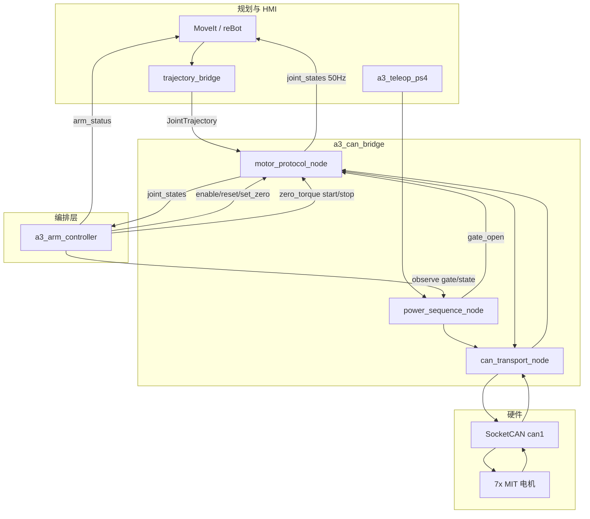

# A3 Edge — 架构文档

> **Status:** active  
> **产品线：** A3 Edge（`edge`）— 边缘全栈线（主线）

## 概述

A3 Edge 将完整 ROS 2 控制栈部署在 RK3588 板载 Linux 上，通过 SocketCAN 直接与 MIT 电机通信。轨迹规划、CAN 执行、电源序列、遥操作均在同一设备完成，追求最低板内延迟。

## 运行时分层

| 层 | 组件 | 说明 |
|----|------|------|
| 1. Platform | RK3588 SocketCAN、`can-up.service` | CAN 接口 1 Mbps 上电配置 |
| 2. Execution | `a3_can_bridge` | transport + MIT protocol + power_sequence |
| 3. Description | `a3_description`、`a3_moveit_config` | URDF、MoveIt、ros2_control |
| 4. Shell | `a3_arm_vendor` + `trajectory_bridge` | reBot 规划/遥操作话题桥接 |
| 5. HMI | `a3_teleop_ps4` | PS4 电源序列（F3）、YAML 笛卡尔 Servo + 夹爪 + 命名姿态（F16） |
| 6. Orchestration | `a3_arm_controller` | 状态机/初始化闭环/示教/状态聚合/模式仲裁/对外门面（F21） |

## 数据流



## 包依赖

| 包 | 职责 |
|----|------|
| `a3_description` | URDF、robot_state_publisher、mock hardware launch |
| `a3_moveit_config` | MoveIt 规划、demo launch |
| `a3_can_bridge` | 旧栈 CAN 传输、MIT 编解码、电源序列（F78 起 deprecated） |
| `a3_hardware_interface` | ros2_control 硬件插件：SystemInterface（SocketCAN + MIT）、重力补偿控制器 |
| `a3_trajectory_processing` | Ruckig/TOTG 保几何重定时服务节点 |
| `a3_bringup` | 全栈统一 launch（hardware:=mock\|can） |
| `a3_teleop_ps4` | PS4 遥操作（电源 F3、YAML 映射 F16） |
| `a3_arm_controller` | 机械臂编排层（生命周期/示教/状态聚合/仲裁，F21） |
| `a3_lerobot_config` | LeRobot 集成脚手架 |

### Launch 链

主入口：`ros2 launch a3_bringup a3_bringup.launch.py hardware:=mock|can`（F78 起唯一产品入口，mock/can 拓扑完全一致）

```
a3_bringup.launch.py
├── robot_state_publisher（常开）
├── ros2_control controller_manager（常开；200 Hz）
│   ├── joint_state_broadcaster（active；标准 /joint_states）
│   ├── arm_controller JTC L1–L6（inactive 启动，编排层 enable 才激活）
│   ├── gripper_controller JTC L7（inactive 启动）
│   └── zero_torque_controller（inactive 常驻，自由拖动时互斥切换）
├── move_group（OMPL + Pilz PTP/LIN/CIRC 双管线 + Sequence，直连 JTC FJT action）
├── retime_trajectory_node（保几何重定时，Ruckig/TOTG）
├── servo_node + servo_mode_bridge（常驻；TwistStamped + JointJog 双输入 → arm JTC 话题）
├── a3_arm_controller（编排层；fjt_action + controller_switch 后端）
├── a3_gripper_controller（产品节点；出口指 gripper JTC 话题）
├── a3_mqtt_bridge（use_mqtt，默认开；web 遥测/指令 F18/F23）
├── ps4_teleop.launch.py（use_teleop，默认开）
└── rviz（use_rviz，默认关；单模型 el_a3_view.rviz）
```

硬件模式：`hardware:=mock`（mock_components/GenericSystem，无 CAN/电机可起栈）；
`hardware:=can`（`a3_hardware_interface/A3MITHardwareInterface`，SocketCAN + MIT，
接口 `can_interface`，真机 can1；vcan 验收 vcan0 + vcan_motor_sim）。旧 can_bridge C++ 栈
（can_transport/motor_protocol/power_sequence + trajectory_bridge + 手搓 FJT action）由
`edge_legacy_stack.launch.py` 保留，deprecated，仅历史回归。

仿真/专项 launch 仍独立：

```
edge_sim_wave_a.launch.py      Wave A 无 CAN 仿真（sim_executor + gravity + zero→ready）
edge_moveit_execute.launch.py  Wave B 仿真执行栈（sim_executor + FJT + IK + trajectory_bridge）
edge_teleop_sim.launch.py      PS4 遥操作仿真（Servo + mapper + sim_executor + 可选 RViz）
edge_web_sim.launch.py         Web 仿真闭环（sim_motor + arm_controller + mqtt_bridge + gripper）
servo.launch.py                MoveIt Servo 独立路径（自带 RSP + sim_executor）
urdf_dir_check.launch.py       RViz 双模型 URDF 方向校验
```

## 话题契约

详见 [shared/TOPIC_CONTRACT.md](../shared/TOPIC_CONTRACT.md)。

摘要：

- 轨迹输入：`/joint_group_effort_controller/joint_trajectory`（编排层多点/FJT/重力保持）+ `/a3/servo/joint_trajectory`（F65：Servo 50Hz 单点，仅 gate 开 + SERVO 模式消费；两通道互锁分离）
- 关节输出：`/joint_states`（50 Hz）
- 门控：`/power_sequence/gate_open`（F66：gate **关沿作废全部运动意图**——轨迹/servo/MIT 目标缓存全清；gate 开后仅以新鲜反馈重锚，杜绝硬急停后人工挪臂、再使能被甩回旧位姿）
- 命令：`/power_sequence/command` = `start|shutdown|set_zero`
- 使能：电源序列 EnableInit 裸 CAN `0x03`（保持期 50 ms 补发防漏帧）与 `/a3/motor/enable` 服务两条路径；F66 起使能模式上升沿在 motor_protocol_node 反馈处理中**无条件**执行重锚+0.8 s kp/kd 软起步（不再受 `enable_mode_rising_smoothing` 开关控制）；refresh 另有 0.25 rad 防甩兜底；gate Running + IDLE 无轨迹时 enable 服务放行（F32 恢复通道，解锁橙灯死锁）

## 控制参数

关键运行时参数（[control_gains.yaml](../../src/a3_can_bridge/config/control_gains.yaml)）：

- MIT `kp`/`kd`：80.0 / 2.0
- 最大 CAN 发送速率：200 Hz / 电机
- 关节状态反馈：50 Hz
- 电源门控：启用

## 多臂

- 配置：[multi_arm_config.yaml](../../src/a3_description/config/multi_arm_config.yaml)
- 每臂独立 CAN：`can0`..`can3`
- Launch：`multi_arm_control.launch.py`

## 与 A3 CloudEdge 的差异

| 项目 | A3 Edge | A3 CloudEdge |
|------|---------|--------------|
| 主控 | RK3588 全栈 | 内网服务器 + ESP32 |
| CAN 路径 | SocketCAN 内核驱动 | ESP32 TWAI/CAN 控制器 |
| 规划位置 | 板载 | 服务器集中 |
| 网络依赖 | 无（本地闭环） | WiFi 轨迹下发 |
| `a3_can_bridge` | 生产使用 | 开发期 P0 验证可借用 |

## 关联文档

- [REQUIREMENTS.md](REQUIREMENTS.md)
- [QUICKSTART.md](QUICKSTART.md)
- [PLATFORM_CAN.md](PLATFORM_CAN.md)
- [shared/SAFETY.md](../shared/SAFETY.md)
- [shared/CONTROL_ROADMAP.md](../shared/CONTROL_ROADMAP.md) — 控制功能分层与 C1–C8 落地建议

## 源码路径

```
src/a3_can_bridge/     # CAN 栈（本产品线核心执行层）
src/a3_bringup/        # 全栈 launch
systemd/can-up.service # CAN 上电服务
```
