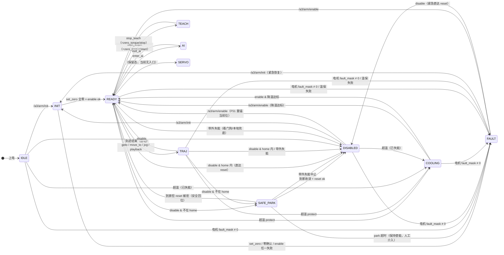
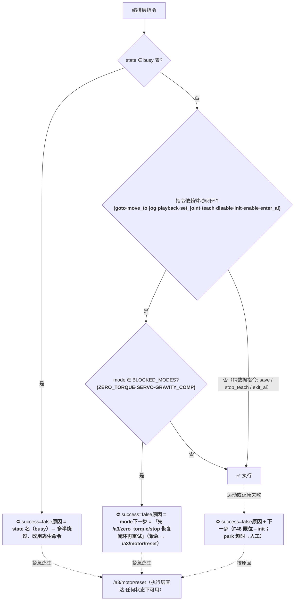
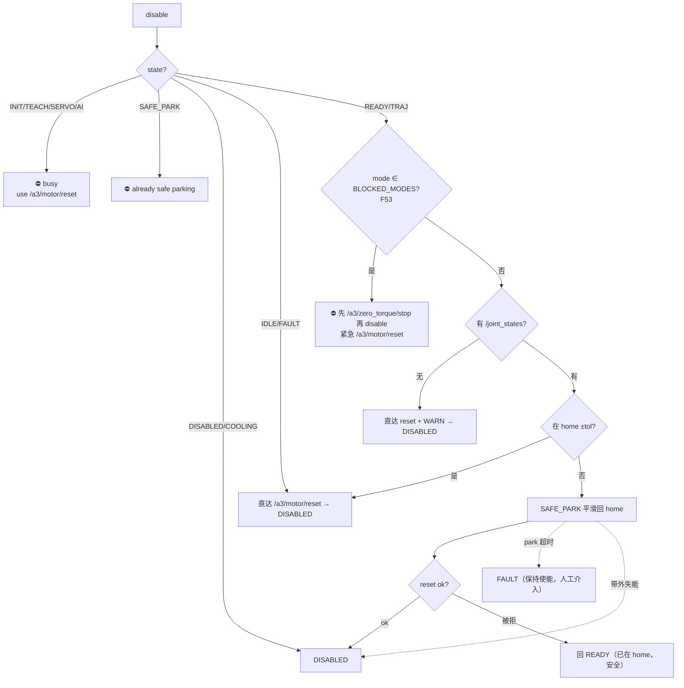

# 编排层状态机（a3_arm_controller）

> **产品线：** A3 Edge
> **对象：** `src/a3_arm_controller/a3_arm_controller/arm_controller.py`（编排层）及其与执行层（`a3_can_bridge/motor_protocol_node`）、看门狗（`arm_monitor_node`）的跨层契约
> **需求：** [REQUIREMENTS.md](REQUIREMENTS.md) F40/F45/F50/F51/F52/F53
> **踩坑：** [LL-045](../lessons_learned/LL-045-disable-in-zero-torque-dead-path.md)（F53 动因）、[LL-044](../lessons_learned/LL-044-disable-park-3s-too-fast.md)、[LL-043](../lessons_learned/LL-043-mit-zero-frame-in-startup.md)
> **更新：** 2026-09-16（F53：指令×状态×模式全组合「不罢工」）

---

## 1. 目的：任何指令×状态×模式组合都不「罢工」

「罢工」定义为：指令被**静默接受**（返回 success 或只留空，臂实际不动/不执行），或失败但消息**不含可执行的下一步**。F53 把编排层收束为一条原则：

> **每条编排层指令，要么真正执行；要么 `success=false`，且消息给出「动作 / 原因 / 下一步」（三段式，含逃生命令）。** 绝不在运动指令上静默放行到一潭死水。

编排层是**状态机**（11 态），但它不知道执行层（C++）内部的自有模式（`zero_torque_active_` 等）——模式通过共享话题 `/a3/control_mode` 广播。**状态（谁在控制）× 模式（执行层听不听轨迹）是两维**，任何只查一维的守卫都有缺口。典型案例（F53 动因）：零力矩手感测试直打 `/a3/zero_torque/start`，编排层状态仍 `READY` 但 `self._mode == "ZERO_TORQUE"`——旧代码 `disable` 只查 state 不查 mode → safe park 轨迹被执行层静默丢弃 → 看门狗误切。

## 2. 三层职责

| 层 | 节点 | 管什么 |
|----|------|--------|
| **编排层** | `a3_arm_controller` | 11 态状态机、指令路由、F40 park/F44 温度/F48 限位门禁、DISABLED 兜底 |
| **执行层** | `motor_protocol_node`（C++） | 模式所有权（IDLE/TRAJ_RUNNING/SERVO/ZERO_TORQUE）、200 Hz 插值 + MIT 协议、F51 使能重锚、轨迹门（ZERO_TORQUE/SERVO 丢弃） |
| **看门狗** | `arm_monitor_node` | 跨源比对（期望 vs 实际）、FOLLOW_STUCK/HOLD_DRIFT/STALE_JS/UNEXPECTED_DISABLE → stop→reset 阶梯、意图边界重基准 |

编排层状态**唯一权威**；执行层模式经 `/a3/control_mode` **双发布方共享**（编排层 `_publish_mode` + 执行层 `PublishControlMode`），`self._mode = 最近到达的那条`。F53 之前正是这里脱钩：外部 zero_torque 沿让执行层把模式拧到 `ZERO_TORQUE`，编排层的守卫表却没把它算进去。

## 3. 状态定义（11 态）

| 状态 | 含义 | 臂/电机状态 | 备注 |
|------|------|-------------|------|
| `IDLE` | 上电未使能 | 电机 off | 初始态 |
| `INIT` | set_zero→确认→enable | 使能中 | 阻塞同步 |
| `READY` | 使能就绪 | 闭合保位（kp 软起步后额定） | 事件主战场 |
| `TRAJ` | goto/move_to/jog/playback 运动 | 轨迹流 | 结束后自动回 READY |
| `TEACH` | 示教拖动 | 零力矩（执行层 ZERO_TORQUE） | ⇔ zero_torque/start|
| `AI` | AI/大模型接管 | 外部直发轨迹 | 编排层只守入口 |
| `SERVO` | **保留/防御态** | （当前无入口） | PS4 伺服走 mode=SERVO 共享位 |
| `SAFE_PARK` | F40 平滑回 home | park 轨迹 | disable/超温保护中 |
| `DISABLED` | 已失能 | 电机 off | disable / 带外失能到达 |
| `COOLING` | 超温保护降温 | 电机 off | 降温达标才放行 enable |
| `FAULT` | 故障锁存 | 已紧急 reset | 需人工恢复（init/enable） |

## 4. 状态机（Mermaid）

> **模式维（`/a3/control_mode`，与状态正交、共享）：** `IDLE` / `TRAJ_RUNNING` / `READY`（上述发布方自己发）⇄ `ZERO_TORQUE` / `SERVO`（执行层发出）。图中**所有发轨迹的转移**（READY→TRAJ、READY→TEACH、READY/AI→SAFE_PARK、温保 park）都被 `mode ∈ BLOCKED_MODES = {ZERO_TORQUE, SERVO, GRAVITY_COMP}` 挡住（见 §6 矩阵）。状态 `READY`＋mode `ZERO_TORQUE` 是 F53 前唯一的"状态正常、执行层不听轨迹"的脱钩组合。

## 5. 指令路由（命令守卫流程）

## 6. 指令 × 状态 矩阵（模式维合并标注）

图例：✅ 执行　|　⛔ 拒绝（原因见表注）　|　🔴 拒绝 + **mode∈BLOCKED_MODES**（F53 新增，消息含 `先 /a3/zero_torque/stop`）　|　🔧 条件放行　|　· 不适用/幂等

| 指令 | IDLE | INIT | READY | TRAJ | SERVO¹ | TEACH | AI | SAFE_PARK | DISABLED | COOLING | FAULT |
|------|:----:|:----:|:-----:|:----:|:------:|:-----:|:--:|:---------:|:--------:|:-------:|:-----:|
| **init** | ✅ | ⛔b | ✅ | ⛔b | ⛔b | ⛔b | ⛔b | ⛔b🔴 | ✅ | 🔧c | ✅(恢复) |
| **enable** | ✅ | ⛔b | ✅ | ⛔b | ⛔b | ⛔b | ⛔b | ⛔b🔴 | ✅ | 🔧c | ✅ |
| **disable** | ✅ | ⛔h | 🔲 §7 | 🔲 §7 | ⛔h | ⛔h | ⛔h | ⛔p | · | · | ✅(直接) |
| **goto/move_to/jog/playback** | ⛔s | ⛔s | ✅ | ⛔s | ⛔s | ⛔s | ⛔s | ⛔s | ⛔s | ⛔s | ⛔s🔴 |
| **set_joint_positions** | ⛔s | ⛔b | ✅ | 🔧jog | ⛔b🔴 | ⛔b | ⛔b | ⛔b | ⛔b | ⛔b | ⛔b |
| **start_teach** | ⛔r | ⛔r | ✅ | ⛔r | ⛔r | ⛔r | ⛔r | ⛔r | ⛔r | ⛔r | ⛔r |
| **stop_teach** | ⛔t | ⛔t | ⛔t | ⛔t | ⛔t | ✅ | ⛔t | ⛔t | ⛔t | ⛔t | ⛔t |
| **enter_ai** | ✅ | ⛔b | ✅ | ⛔b | ⛔b | ⛔b | ⛔b | ⛔b | ⁇ | ⁇ | ⁇ |
| **exit_ai** | ⛔a | ⛔a | ⛔a | ⛔a | ⛔a | ⛔a | ✅ | ⛔a | ⛔a | ⛔a | ⛔a |
| **save/save_named_pose** | ✅² | ✅² | ✅² | ✅² | ✅² | ✅² | ✅² | ✅² | ✅² | ✅² | ✅² |

注：
- **b** busy：`state=N`（各指令拒绝表不同，即 §5 的 ST 守卫）。
- **🔴** 均 F53 补的 `mode ∈ BLOCKED_MODES` 拒绝（详见 [F53](../edge/REQUIREMENTS.md)）：**状态即使在可执行态也不放行**。
- **c** COOLING 条件放行：`enable` 前查全 fresh 关节温度 < protect − 迟滞（F44 `_check_cooling`）；init 前额外 WARN 位检不阻断（F48）；`init` 在 COOLING 也走 c 门。
- **s** 运动指令经 `_can_move` 统一 gate：`require_gate` 且 gate 关 → 拒；**F53 前 FAULT 漏拒（静默放行、臂不动）→ F53 已补**。
- **h** disable 的 INIT/TEACH/SERVO/AI 拒绝 → 消息带 `use /a3/motor/reset for emergency`（F40）。
- **p** 已在 SAFE_PARK → `already safe parking`。
- **🔲 §7** disable 在 READY/TRAJ 按 §7 分流（home 内直达 / 无 js 直达 / 否则 SAFE_PARK），但 **F53 起 mode∈BLOCKED_MODES 一律先拒**（主修复，见 [LL-045]）。
- **jog** `set_joint_positions` 在 TRAJ 只放行 `_jogging`（web 滑动条续动），goto/playback 中拒。
- **r** start_teach 只收 READY（F38 语义：READY = 闭合闭环才可进零力矩拖拽）。
- **t** stop_teach 只收 TEACH（非 TEACH → not teaching）。
- **a** exit_ai 只收 AI（not in AI）。
- **¹** SERVO 保留态无入口（§3）；此处表格仍按守卫表填，防未来接入。
- **²** save 系列只落数据、不问臂状态；记录内容须先 stop_teach。

## 7. disable 分流（`. /a3/arm/disable`）

## 8. 跨层契约：执行层的轨迹门（谁在吞轨迹）

编排层的守卫拦得住自己的指令，但 **AI 外部直发轨迹 / 任何绕过编排层的发布者**直接打到 `/joint_group_effort_controller/joint_trajectory`，由执行层 `OnTrajectory`（`motor_protocol_node.cpp` L857-860）裁决：

| 执行层模式 | 收轨迹？ | 备注 |
|-----------|:---:|------|
| `IDLE` | ✅ | 失能态下收到照存（臂不动——编排层期望如此） |
| `TRAJ_RUNNING` | ✅ 替换 | 新轨迹抢占活跃轨迹（F40 park 靠此换轨） |
| `READY` | ✅ | |
| `SERVO` | ⛔ 丢弃 `Ignore trajectory: mode zero_torque/SERVO` | |
| `ZERO_TORQUE` | ⛔ 丢弃（`zero_torque_active_`） | 零力矩/示教中；**enable/reset/set_zero 都不清该标志**（[LL-045]） |

**`zero_torque_active_` 唯一清除途径：`/a3/zero_torque/stop`，或门控关闭沿（gate-close）。** 这就是为什么 F53 把所有"我依赖臂动"的指令（disable 的 park、enable、init、enter_ai、运动组）绑在同一把 mode 锁上。

## 9. 逃生速查表（任何状态）

| 场景 | 正确命令 | 别误用 |
|------|----------|--------|
| 零力矩下正常退出 | `/a3/zero_torque/stop`（恢复 kp 锚定当前位）**→** 再 disable/enable/init | 直接 reset/enable（模式不清零 → 重使能后 kp 仍 0，臂悬浮"伪成功"） |
| 零力矩下紧急失能 | `/a3/motor/reset`（随后 `/a3/zero_torque/stop` 清零标志，再正常走 enable） | 只 reset 就重使能 |
| 状态机拒绝某指令 | 读失败消息下一段（三段式：动作/原因/下一步） | 重复无脑重试 |
| FAULT（park 超时/电机 fault） | 人工介入：地址故障或 enable/init 恢复 | 忽略继续调运动指令（F53 已拒） |
| F48 限位拒使能 | 摆到已知位姿 → `/a3/arm/init`（重建零位帧） | 放宽限位 |

## 10. F53 修复清单（2026-09-16）

1. `_disable_cb`：**主缺口**——补 `mode ∈ BLOCKED_MODES` 拒绝对（此前 docstring 声明拒绝、代码没查 mode）。
2. `_init_cb`：补 SAFE_PARK busy + BLOCKED_MODES 拒绝（set_zero 打碎零位帧；enable 不退出 zero_torque → init 伪成功）。
3. `_enable_cb`：补 BLOCKED_MODES 拒绝（重锚当前位但 kp 仍 0 → 臂继续悬浮）。
4. `_can_move`：拒绝表补 `FAULT`（此前静默接受轨迹、臂不动）。
5. `_enter_ai_cb`：补 BLOCKED_MODES 拒绝（AI 轨迹被执行层丢弃）。

状态×模式二维守卫 + 三段式拒绝消息 + 两根逃生锚（`/a3/zero_torque/stop`、`/a3/motor/reset`）= 编排层对任何指令都不静默。

## 11. 关联文档

- [REQUIREMENTS.md](REQUIREMENTS.md) F40（disable park）/ F45（11 态）/ F50（看门狗）/ F51（使能重锚+模式语义）/ F52（降级档）/ **F53（本页）**
- [LL-045](../lessons_learned/LL-045-disable-in-zero-torque-dead-path.md) / [LL-044](../lessons_learned/LL-044-disable-park-3s-too-fast.md) / [LL-043](../lessons_learned/LL-043-mit-zero-frame-in-startup.md)
- [shared/SAFETY.md](../shared/SAFETY.md)（失能保护/使能前置条款）