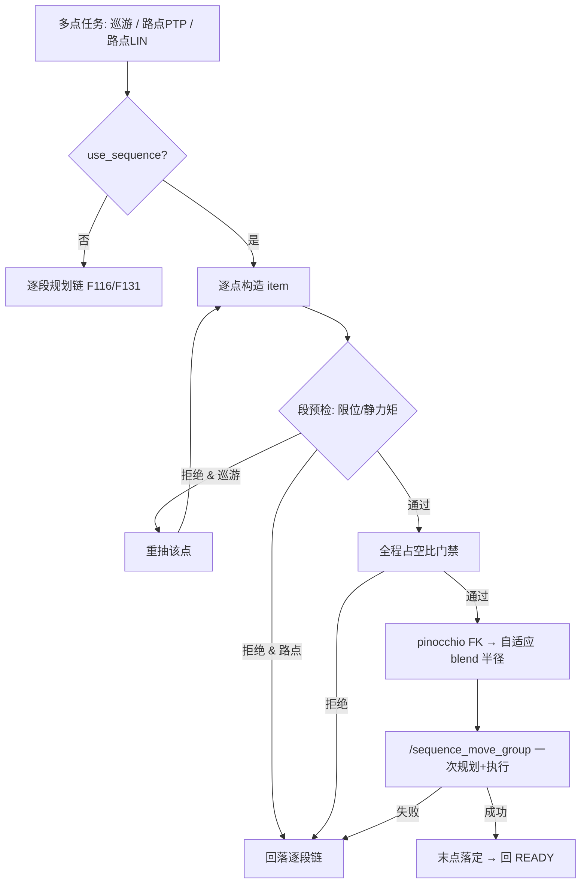

# F134 — 多点任务整序列一次规划/执行：pilz Sequence + blend，中间点不停车

- **说明：** F116 巡游与 F131 路点回放初版均为"走一个点规划一次"（N 次独立 MoveGroup action），每段到位即停——中间点必然静止、节拍碎。升级为 **pilz_industrial_motion_planner Sequence**（action `/sequence_move_group`，`MoveGroupSequence`）：把 N 个目标构造成 `MotionSequenceItem[]`（PTP: group `arm` / planner PTP；LIN: group `arm_lin` / planner LIN），**一次下发整体规划并连续执行**。三链路（巡游、路点 PTP、路点 LIN）统一经 `_sequence_move_group` 发送/解析，结果读 `MotionSequenceResponse.planned_trajectories[]` 总时长。下发前逐段预检（`_static_segment_violation`）：① 目标关节须在 URDF 限位内（越限 pilz 报 -16 INVALID_GOAL_CONSTRAINTS，实测历史 snap 存在 L4=-1.115 < 下限 -1.047）；② 关节直线 21 点 F107 静态重力矩采样；③ 全程 F42 占空比门禁。**巡游链路预检拒绝的段不放弃整条**：当场重抽点位（沿用 `random_tour_leg_retries` 语义），重抽耗尽才回落。**自适应 blend 半径：** pilz 要求相邻 blend 圆盘不重叠（`r_{i-1}+r_i ≤ 中间点两侧距离`），固定 0.02m 在短腿上会报 "Blending failed"（99999）；按 pinocchio FK 的相邻点距把每项压到 `0.45×min(两侧段距)`，段长不足该项降为 0（允许该处短暂停车）。末项 blend 恒 0。任何 Sequence 失败/不可用 → 自动 WARN 并**回落原有逐段链**（F116 逐腿重试、F131 逐段重试，行为完整保留）；开关 `random_tour_use_sequence` / `waypoint_use_sequence`。仿真栈 `edge_web_sim.launch.py` 补 MoveGroupSequenceAction capabilities（真机 launch 早已有之）。

> **blend 语义（工业示教器 C_DIS 一致）：** 过弯轨迹在 blend 圆盘内**不精确穿过中间点**；
> "精确过点 + 速度非零"物理上不可能。需要精确到点的任务把对应点 blend 降 0（段长不足时自动如此）。
- **验收标准：**
  1. 仿真巡游 10 腿：单次 `/sequence_move_group` 完成（`tour sequence completed`，实测 12.0s），/joint_states 内部 538 采样仅 3 处 40ms 轻微减速（短腿降 blend 位置），其余全程关节速度非零
  2. 仿真路点 PTP 5 点：单次 Sequence 完成（实测 5.1s），内部 226 采样近零速度仅 2 个（40ms 噪声级），p10 速度 0.346 rad/s
  3. 仿真路点 LIN 5 点：单次 Sequence 完成（实测 12.7s），内部 550 采样零停止，段内保持直线
  4. 越限/静力矩被拒点位在巡游中触发重抽（日志 `redraw`），不导致整条失败；Sequence action 失败时自动回落逐段链且行为与 F116/F131 一致
  5. 真机回归：三链路连续过弯；观测 LIN 0.2 缩放下关节加速度/力矩尖峰与 blend 偏离量
- **关联：** F116（随机巡游/逐腿回退链）、F131（路点示教/逐段回退链）、F107（静态力矩门禁）、F42（占空比门禁）、F68/F133（retime）、pilz MotionSequence API、[shared/TOPIC_CONTRACT.md](../shared/TOPIC_CONTRACT.md)、[shared/CONTROL_ROADMAP.md](../shared/CONTROL_ROADMAP.md)（Wave A 轨迹连续性对标）
- **状态：** `implemented`（2026-10-01 仿真三链路 PASS，含连续性速度包络实测；真机回归待上电）

> 返回索引：[REQUIREMENTS.md](../REQUIREMENTS.md)
