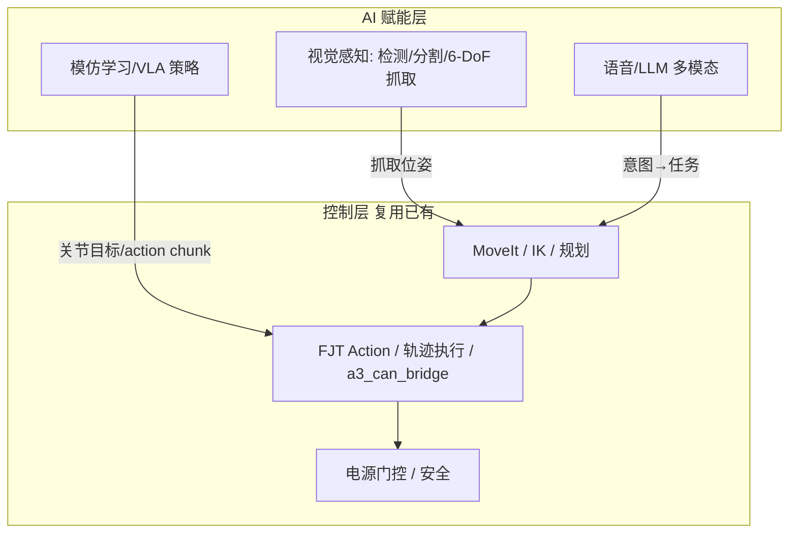
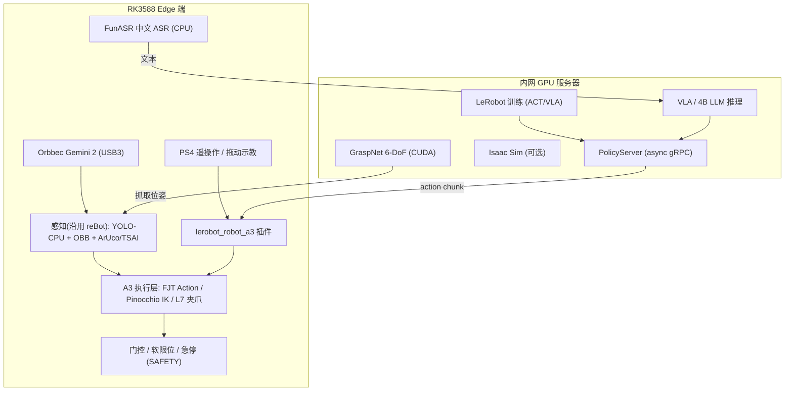
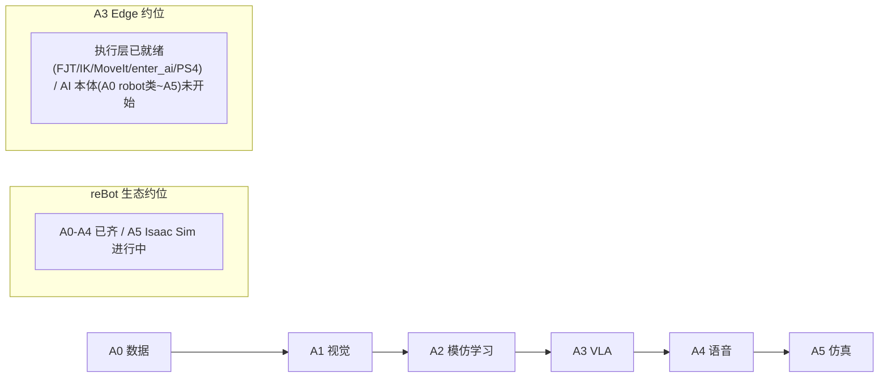
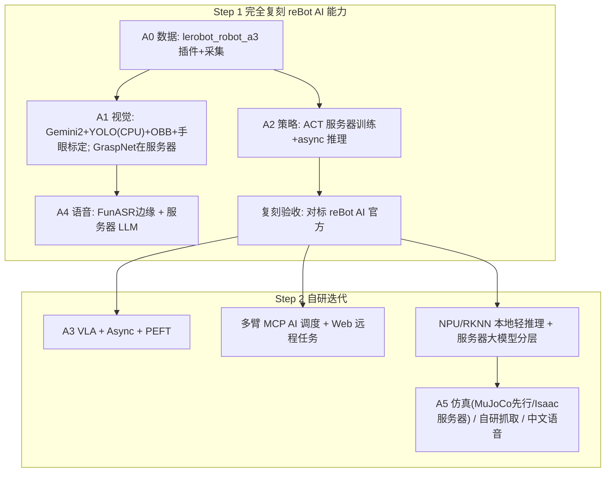

# 机械臂 AI 功能开发路线

> **Status:** draft（2026-09 修订：已核对 reBot 官方三个 AI 源码仓库的实际文件、依赖与平台约束，新增 **§3.5 reBot 源码→A3 复刻映射** 与 **§7 硬件清单与无硬件仿真可行性** 两节；AI 需求 ID 草案顺延为 F24–F30）
> **范围：** AI 赋能（数据采集、模仿学习 / VLA、视觉抓取、语音多模态、仿真）  
> **不含：** 控制栈（驱动、轨迹、规划、动力学、力控，见 [CONTROL_ROADMAP.md](CONTROL_ROADMAP.md)）  
> **产品线：** 以 [A3 Edge](../edge/ARCHITECTURE.md) 为主线；CloudEdge 交叉引用 [cloud_edge/ROADMAP.md](../cloud_edge/ROADMAP.md)

## 文档用途（给下一步规划用）

本文档是 **A3 具身智能（AI 赋能）能力建设的规划底稿**，不是需求条目本身。用法：

1. **对标：** 用第 4 章矩阵看清与 [reBot-DevArm](https://github.com/Seeed-Projects/reBot-DevArm) 生态在 AI 能力上的差距  
2. **分期：** 用第 5 章 **Step 1（完全复刻 reBot）→ Step 2（自研迭代）** 排实现顺序  
3. **立项：** 每启动一项，先在 [`docs/edge/REQUIREMENTS.md`](../edge/REQUIREMENTS.md) 写需求 ID 与验收，再改 `src/`  
4. **选型：** 第 1、6 章固定「训练放哪、推理放哪、NPU 跑什么、何时上 CloudEdge MCP」等决策，避免实现时反复争论

**近期目标：** 先让 A3 Edge **AI 能力至少对齐 reBot 官方 AI 栈**（LeRobot 数据采集与训练、深度相机视觉抓取、语音控制），再发展结合 CloudEdge 多臂 MCP 与 RK3588 NPU 的自研 AI 能力。

本文档回答：

1. 桌面/协作臂的 AI 赋能通常按什么顺序做（A0–A5）  
2. reBot 生态与 A3 Edge 各自做到哪一步  
3. A3 如何分两步落地（含 Edge / CloudEdge 算力分工、NPU vs 服务器推理策略）

---

## 1. AI 能力全景：训练 vs 推理 vs 感知 vs 交互

### 1.1 职责边界

AI 赋能与控制栈是**分层协作**，不是「AI 替代控制」。AI 输出的是**目标（关节/笛卡尔/夹爪）**，最终仍经控制栈（[CONTROL_ROADMAP.md](CONTROL_ROADMAP.md) 的 L2/L5 执行层）落到电机。

| 组件 | 做什么 | 不做什么 |
|------|--------|----------|
| **视觉感知** | RGB-D 采集、目标检测/分割、手眼标定、6-DoF 抓取姿态估计 | 不直接发 CAN；不替代运动规划 |
| **模仿学习 / VLA 策略** | 从演示数据训练策略，输出动作块（action chunk）驱动机械臂 | 不是控制执行层；输出需经门控/限位 |
| **语音 / LLM** | ASR 转写 → LLM 解析意图 → 调用任务接口 → TTS 播报 | 不接实时闭环；不替代安全停机 |
| **仿真** | Isaac Sim 合成数据、遥操作仿真、策略 S²E 迁移 | 不替代真机标定与验收 |

### 1.2 训练与推理的算力边界（A3 的核心差异）

reBot 官方全程押注 **NVIDIA Jetson（CUDA / TensorRT）**：检测走 TensorRT、4B LLM 走 TensorRT-Edge-LLM、训练走 A100/RTX 4090。A3 Edge 是 **RK3588（6 TOPS NPU / RKNN）**，无 CUDA、无独立 GPU。下表「已核实平台事实」列基于 2026-09 对 reBot 视觉抓取仓 `environment.yml` / `config/default.yaml` / 官方 FAQ 的实际核对（见 §3.5）：

| 算力位 | reBot（Jetson 口径） | 已核实平台事实（源码级） | A3 Edge 选择 |
|--------|-------|--------------|--------------|
| 训练（ACT/VLA/GraspNet） | 服务器 A100 / 本地 RTX 4090 | LeRobot 训练、VLA 微调、GraspNet pointnet2/knn 算子均 **CUDA-only**，CPU 报 "CPU not supported" | **内网/云 GPU 服务器**（复用 CloudEdge 服务器侧） |
| 大模型推理（4B LLM / VLA） | Jetson TensorRT-Edge-LLM（MTP 投机解码） | 依赖 TensorRT/CUDA，RK3588 无对应运行时 | **服务器**（CloudEdge MCP / async inference cloud 模式） |
| 目标检测/分割 | Jetson TensorRT（YOLO11n-seg） | 抓取仓 YOLO/YOLOE 默认 **`device: "cpu"`**，`ultralytics==8.4.35` CPU 即可跑；OBB 抓取/ArUco 手眼标定为纯 OpenCV/numpy | **CPU 先跑通 → RK3588 NPU（RKNN）** 本地低延迟（可选优化，非必须） |
| GraspNet 6-DoF 抓取 | Jetson TensorRT | **强制 CUDA**（pointnet2/knn 需 nvcc 编译，仅 CUDA 张量） | **GPU 服务器**跑姿态估计，结果回传边缘执行 |
| 语音 ASR | Jetson Qwen3 流式 ASR | 抓取仓 `environment.yml` 实际用 **FunASR（`funasr==1.1.3`）+ modelscope + torchaudio**，CPU 可跑中文 ASR | FunASR 边缘 CPU；LLM 语义走服务器；TTS 待评估 |
| 语音 TTS | Jetson MOSS-TTS-Nano | 轻量 TTS，CPU/边缘可评估 | 轻量中文 TTS 本地评估；不行则服务器 |
| 仿真 | Jetson/PC Isaac Sim（CUDA） | Isaac Sim 需 NVIDIA GPU；LeRobot 仿真后端 MuJoCo/PyBullet **CPU 可跑** | 无硬件阶段先 **MuJoCo（CPU）**；Isaac Sim 仅服务器 |

> 结论：**训练、VLA/LLM、GraspNet、Isaac Sim 上 GPU 服务器；YOLO 检测/OBB 抓取/手眼标定/FunASR 在 RK3588 上 CPU 即可复刻（NPU/RKNN 是后续加速项而非前置条件）**。这与 CloudEdge「服务器一套算法多臂共用」天然契合，是本文第 6 章的固定决策。

### 1.3 AI 输出 ≠ 免安全（沿用 SAFETY）

AI 策略/VLA 输出的动作仍需经过 [SAFETY.md](SAFETY.md) 的软限位、gate、急停、断连看门狗。**禁止 AI 直接写 CAN / 绕过电源门控**；大模型/VLA 推理延迟不可用于 200 Hz 力闭环。语音/LLM 接口必须鉴权（内网），公网不暴露。

---

## 2. AI 能力分层（A0–A5，由数据到智能）

完善桌面/协作臂 AI 赋能的推荐顺序。后一层依赖前一层稳定；A2+ 依赖控制栈 L5 真机闭环稳定。

### A0 — 数据基础与采集

| 项 | 内容 |
|----|------|
| **能力** | LeRobot 接入机器人、电机标定、遥操作采集演示数据（episode）、数据集可视化/回放 |
| **常见组件** | HuggingFace LeRobot、`lerobot-record`/`lerobot-calibrate`/`lerobot-dataset-viz`、遥操作器 |
| **验收** | 稳定采集 ≥50 episode；标定文件可跨机复用；`/joint_states` 与相机帧同步入数据集 |
| **常见坑** | 与 `a3_can_bridge` 抢同一 `can1`；采集期电机未使能；标定缓存未清导致跨机不一致 |

### A1 — 视觉感知

| 项 | 内容 |
|----|------|
| **能力** | RGB-D 深度相机、目标检测/分割、手眼标定（TSAI）、6-DoF 抓取姿态估计 |
| **常见组件** | YOLO/YOLOE（open-vocab，CPU 可跑）、GraspNet（CUDA，服务器）、OBB 最小外接矩形、**Orbbec Gemini 2**（`pyorbbecsdk` arm64 预编译 wheel，主选）；RealSense D405/D435i（arm64 需源码编译，备选） |
| **验收** | 桌面目标可识别并给出可达抓取位姿；手眼标定后相机系→基座系误差在容差内 |
| **常见坑** | 手眼标定不做就把相机坐标当基座坐标；深度相机走 USB HUB/USB2 掉帧（Gemini 2 需 USB3）；arm64 上 `pip install pyrealsense2` 无 wheel（必须源码编译 librealsense，Gemini 2 无此坑） |

### A2 — 模仿学习策略

| 项 | 内容 |
|----|------|
| **能力** | 从 A0 数据集训练端到端策略并部署推理（单任务行为克隆） |
| **常见组件** | ACT、Diffusion Policy、`lerobot-train`、`lerobot-record`（policy 推理） |
| **验收** | 单任务成功率达标；策略输出经 FJT/执行层落地；推理延迟可接受 |
| **常见坑** | 数据集 <50 episode 泛化差；把策略输出直接当整轨目标而非 action chunk |

### A3 — VLA / 基础模型

| 项 | 内容 |
|----|------|
| **能力** | 视觉-语言-动作模型，语言条件任务、跨任务泛化、PEFT 微调、异步推理 |
| **常见组件** | SmolVLA、Pi0/Pi0.5、GR00T N1.5、OpenVLA、LoRA、LeRobot async inference（PolicyServer/RobotClient） |
| **验收** | 自然语言指令驱动任务；async inference 下动作块不空转 |
| **常见坑** | 大 VLA 本地跑不动；async gRPC 未鉴权暴露公网 |

### A4 — 语音 / 多模态交互

| 项 | 内容 |
|----|------|
| **能力** | 语音→意图→任务→语音反馈全链路；唤醒词、DoA 空间感知 |
| **常见组件** | ASR（**FunASR** `funasr==1.1.3`，reBot 抓取仓实际使用、CPU 可跑中文；Whisper 备选）、LLM（服务器 Ollama/Qwen3.5）、TTS（MOSS-TTS 或轻量中文 TTS）、USB 麦克风 / reSpeaker 阵列（可选）、OpenWebUI |
| **验收** | 「抓住桌上的水杯」→ 视觉抓取 → 播报结果，内网闭环 |
| **常见坑** | LLM 意图未与任务 API 契约对齐；语音接口无鉴权；把 4B 级 LLM/TensorRT-Edge-LLM 当成本地可跑（RK3588 无 CUDA，语义理解必须上服务器） |

### A5 — 仿真与合成数据

| 项 | 内容 |
|----|------|
| **能力** | 仿真遥操作、合成数据、sim-to-real 迁移；无硬件阶段先跑通数据流 |
| **常见组件** | **LeRobot EnvHub（MuJoCo / PyBullet，CPU 可跑）优先**；NVIDIA Isaac Sim / USD / 域随机化（需 NVIDIA GPU，仅服务器） |
| **验收** | 仿真内策略可训练并迁移真机；无硬件阶段 LeRobot 采集/训练/回放数据流在 MuJoCo 或现有 `sim_executor` 上跑通 |
| **常见坑** | 一上来就押 Isaac Sim 但手头无 NVIDIA GPU（RK3588 跑不了）；仿真物理参数与真机差异过大导致迁移失败 |

---

## 3. reBot AI 功能全清单（Step 1 复刻核对源）

> 来源：reBot-DevArm 官方 README「Roadmap & Status」表 + Seeed Wiki。状态为官方口径（截至 2026-07）。

| # | 功能 | 状态 | 关键组件 / 命令 | 硬件依赖 | 来源 |
|---|------|------|-----------------|----------|------|
| 1 | **LeRobot 端到端集成** | ✅ 完成 | `rebot_b601_follower` / `rebot_b601_rs_follower` robot 类 + `rebot_102_leader` 遥操作器；原生进 HuggingFace LeRobot（commit #3624/#4071） | CAN 电机 + leader arm | [B601-DM LeRobot](https://wiki.seeedstudio.com/rebot_arm_b601_dm_lerobot/) · [B601-RS LeRobot](https://wiki.seeedstudio.com/rebot_arm_b601_rs_lerobot/) |
| 2 | **遥操作采集** | ✅ 完成 | `lerobot-teleoperate`；StarArm102 leader → follower 双臂遥操作 | leader arm（FashionStar UART 舵机） | 同上 |
| 3 | **标定** | ✅ 完成 | `lerobot-calibrate`；follower CAN / leader UART 标定 | — | 同上 |
| 4 | **数据集采集/可视化/回放** | ✅ 完成 | `lerobot-record` / `lerobot-dataset-viz` / `lerobot-replay` | — | 同上 |
| 5 | **策略训练** | ✅ 完成 | `lerobot-train`；`act` / `diffusion` / `sac` / `smolvla` / `pi0` / `pi05` / `groot` | CUDA GPU | 同上 |
| 6 | **VLA 模型** | ✅ 完成 | SmolVLA、Pi0/Pi0.5、GR00T N1.5、OpenVLA；PEFT/LoRA 微调 | CUDA GPU | 同上 |
| 7 | **异步推理（Async Inference）** | ✅ 完成 | `policy_server` + `robot_client`（gRPC）；单机/LAN/云三模式 | GPU（可远程） | [HuggingFace Async](https://huggingface.co/docs/lerobot/main/async) |
| 8 | **视觉抓取（YOLO + 深度相机）** | ✅ 完成 | YOLO/YOLOE 检测分割 + OBB 最小矩形抓取姿态 + TSAI 手眼标定 + `reBotArm_control_py` IK 执行 | RGB-D（Orbbec Gemini2 / RealSense D405/D435i） | [Visual Grasping Demo](https://wiki.seeedstudio.com/rebot_arm_b601_dm_grasping_demo/) |
| 9 | **GraspNet 6-DoF 抓取** | ✅ 完成 | YOLO11n-seg TensorRT 过滤 + GraspNet 6-DoF 姿态 + Web UI/CLI/HTTP API | Jetson（TensorRT） | [GraspNet Visual Grasping](https://wiki.seeedstudio.com/rebot_arm_b601_dm_graspnet_visual_grasping/) |
| 10 | **语音控制（全本地）** | ✅ 完成 | 唤醒词 + Qwen3 流式 ASR + MOSS-TTS-Nano + Qwen3.5-4B（TensorRT-Edge-LLM MTP 投机解码） | Jetson Orin NX | [Voice-Controlled Grasping](https://www.seeed.cc/solutions/reference-designs/voice_rebot_arm) |
| 11 | **语音控制（Whisper + Ollama + OpenWebUI）** | ✅ 完成 | Whisper ASR + Ollama 本地 LLM + OpenWebUI + GraspNet；Robot Arm Tools 桥接 HTTP API | Jetson Thor | [Voice Control](https://wiki.seeedstudio.com/voice_control_rebot_arm/) |
| 12 | **reSpeaker 语音阵列** | ✅ 完成 | reSpeaker Flex 4-mic 阵列 + 空间感知 DoA | reSpeaker 麦克风阵列 | [reSpeaker Voice Control](https://wiki.seeedstudio.com/control_rebot_arm_using_voice_with_respeaker_flex/) |
| 13 | **Isaac Sim 仿真** | 🚧 进行中（DM）/ ⏳ 规划（RS） | USD 模型 + 仿真遥操作 + 合成数据 | NVIDIA GPU | [reBot-Isaacsim](https://github.com/Seeed-Projects/reBot-Isaacsim) |
| 14 | **社区贡献** | ※ 非官方 | 被动诊断 monitor、safe park、gamepad teleop IK/FK、D405 eye-in-hand TF | — | [rebotarm_monitor_ros2](https://github.com/danieldoradotalaveron-rb/rebotarm_monitor_ros2) |

**关键约束（复刻时须注意）：**

- reBot 官方 AI 栈全程绑 **Jetson + CUDA/TensorRT**；A3 RK3588 无此生态，第 1.2 节算力分工不可照抄。
- LeRobot 已原生收录 reBot 的 `rebot_b601_follower`（DM，Damiao CAN 电机）与 `rebot_b601_rs_follower`（RS，Robstride 私有总线）；A3（EL05/RS05 MIT 电机）需**自写 robot 类**，复用 `a3_lerobot_config/config/a3_robot.yaml` 的 7-DOF 关节定义（`L1_joint`..`L7_joint`）。
- leader arm（StarArm102）是 reBot 采集演示数据的遥操作器；A3 无此硬件，可用已有 **PS4 遥操作（F16）** 替代。

### 3.5 reBot 源码 → A3 复刻映射（可沿用 vs 必换）

> 依据 2026-09 实际核对：视觉抓取仓 [reBot-DevArm-Grasp](https://github.com/Seeed-Projects/reBot-DevArm-Grasp)（开发镜像 [EclipseaHime017](https://github.com/EclipseaHime017/reBot-DevArm-Grasp)）、控制 SDK [reBotArm_control_py](https://github.com/vectorBH6/reBotArm_control_py)、[huggingface/lerobot](https://github.com/huggingface/lerobot)。图例：🟢 平台无关·可直接沿用 ｜ 🟡 逻辑沿用·后端换成 A3 ROS2 ｜ 🔴 CUDA/Jetson 专属·服务器或替换。

**视觉抓取仓源码结构与平台依赖：**

| 路径 | 作用 | 依赖 | 平台判定 |
|------|------|------|----------|
| `drivers/camera/base.py` / `orbbec_gemini2.py` / `realsense.py` | RGB-D 相机抽象 + Gemini 2 / RealSense 驱动 | `pyorbbecsdk` / `pyrealsense2` | 🟢 Gemini 2 有 **arm64 预编译 wheel**；RealSense arm64 需源码编译 |
| `calibration/aruco_pose.py` / `hand_eye.py` | ArUco 位姿 + TSAI 手眼标定（eye-in-hand） | `opencv-contrib`（ArUco）、numpy | 🟢 纯 CPU，平台无关 |
| `scripts/collect_handeye_eih.py` | 自动走 50 位姿采标定样本（≥5、推荐 15） | 相机 + 机械臂运动 | 🟡 运动部分换 A3 接口 |
| `utils/ordinary_grasp.py` / `transforms.py` | OBB 短轴定抓取朝向 + 深度分位数定高 + 坐标变换 | OpenCV/numpy | 🟢 纯 CPU |
| `scripts/object_detection.py` | YOLO/YOLOE 检测分割（open-vocab） | `ultralytics==8.4.35`，默认 `device:"cpu"` | 🟢 CPU 可跑（RKNN 为后续加速） |
| `scripts/ordinary_grasp_pipeline.py` | 不接臂的抓取位姿估计/可视化（离线调试） | 同上 | 🟢 **无硬件可用录像/数据集跑** |
| `scripts/main.py` | 完整抓取闭环（检测→OBB→手眼→抓取状态机） | 相机 + `grasp_driver` | 🟡 感知沿用，执行换 A3 |
| `drivers/robot/grasp_driver.py` | 夹爪力控状态机 + IK 运动（薄封装 reBotArm SDK） | `motorbridge` + Pinocchio | 🟡 **后端必换**（见下） |
| `scripts/graspnet_camera_demo.py` | GraspNet 6-DoF 姿态估计（仅相机） | GraspNet baseline + **CUDA PyTorch + pointnet2/knn（nvcc）** | 🔴 CUDA-only，服务器 |
| `scripts/grasp.py` | GraspNet 接臂抓取（`--dry-run` 可只算不动） | 同上 + 机械臂 | 🔴 姿态估计在服务器；执行回边缘 |
| `environment.yml` | 环境 | 含 **`funasr==1.1.3`+modelscope+torchaudio+soundfile**（中文 ASR） | 🟢 FunASR CPU 可跑 |

**复刻映射总表：**

| reBot 模块 | A3 处理方式 | 平台 / 备注 |
|------------|-------------|-------------|
| 相机驱动（Gemini 2） | 🟢 **直接沿用** `orbbec_gemini2.py`，`pip install pyorbbecsdk2`（arm64 wheel） | OrbbecSDK_ROS2 `v2-main` 支持 Humble，`gemini2.launch.py`；USB3 |
| ArUco + TSAI 手眼标定 | 🟢 沿用 `calibration/` 算法与 ArUco 标定板 PDF | 纯 CPU；采样本的运动改调 A3 |
| YOLO/YOLOE 检测 + OBB 抓取 | 🟢 沿用 `object_detection.py`/`ordinary_grasp.py`，先 `device:cpu` | RK3588 CPU 可跑；RKNN 为可选加速 |
| `grasp_driver.py` 运动执行 | 🟡 **重写后端**：`motorbridge` → A3 ROS2（FJT Action `/arm_controller/follow_joint_trajectory` 或 `/a3/move_to_pose_ik`；夹爪用 L7 `/a3/gripper_cmd`） | 全程经门控/软限位（SAFETY）；抓取状态机逻辑可沿用 |
| `reBotArm_control_py` 电机层 | 🔴 **不沿用**：它走 Damiao dm-serial / Robstride socketcan | A3 是 EL05/RS05 **MIT 协议** + 自有 C++ `a3_can_bridge`；其 Pinocchio FK/IK、SE(3) 轨迹、重力补偿思路 A3 已具备（PickIk/Pinocchio + F9 重力前馈） |
| LeRobot `rebot_b601_*_follower` robot 类 | 🟡 **参考重写**为独立插件包 `lerobot_robot_a3`（包名前缀 `lerobot_robot_` 自动发现） | 后端走 ROS2：读 `/joint_states`(50 Hz)、发 FJT/轨迹话题；采集前调 `/a3/arm/enter_ai`；复用 `a3_lerobot_config/config/a3_robot.yaml` 的 7-DOF 定义 |
| leader arm（StarArm102）遥操作 | 🟡 用已有 **PS4 遥操作（F16）** 替代；演示数据另可用 `start_teach` 零力矩拖动录制 | 无需采购 leader arm |
| GraspNet 6-DoF | 🔴 **GPU 服务器**训练/推理（pointnet2/knn 仅 CUDA，官方 "CPU not supported"） | 服务器算抓取姿态 → 网络回传 → 边缘 FJT 执行；RK3588 不跑 |
| VLA（SmolVLA/Pi0/GR00T）+ 训练 | 🔴 服务器训练 + async inference（PolicyServer 服务器 / RobotClient 边缘） | gRPC 勿暴露公网（见 §6.4） |
| 语音 ASR | 🟢 FunASR（reBot 实际依赖）边缘 CPU 跑中文转写 | 替代 Jetson Qwen3-ASR |
| 语音 LLM 语义 / TTS | 🔴 4B LLM 上服务器（Ollama/Qwen）；TTS 边缘评估、不行则服务器 | TensorRT-Edge-LLM 为 Jetson 专属 |
| Isaac Sim 仿真 | 🔴 需 NVIDIA GPU，仅服务器/云 | 无硬件阶段先用 MuJoCo（见 §7、A5） |

**复刻期数据流与算力分层：**

---

## 4. 对比矩阵：理想栈 vs reBot vs A3 Edge

### 4.1 成熟度阶梯

> A3 现状要点：**AI 落地所需的"执行/编排层"已扎实**（FJT Action、Pinocchio/PickIk IK、MoveIt 配置、`a3_arm_controller` 的 `enter_ai/start_teach/playback`、`/joint_states` 50 Hz、PS4 遥操作 F16、MQTT `cmd` 白名单已含 `enter_ai/exit_ai`），**缺的是 AI 本体**（LeRobot robot 类、相机/检测/标定、训练/推理、语音、仿真），这些在 `src/` 中代码为零，LeRobot 仅有 `a3_lerobot_config` 一个 YAML 脚手架。

| 层级 | 理想完善栈 | reBot-DevArm 生态 | A3 Edge（本仓库） |
|------|------------|-------------------|-------------------|
| A0 数据采集 | ✅ | ✅ LeRobot 原生 robot 类 + leader 遥操作 | ⚠️ 仅 `a3_lerobot_config` YAML 脚手架；执行/示教接口（enter_ai/teach/playback、`/joint_states` 50 Hz、PS4 F16）已就绪，**缺 LeRobot robot 类插件** |
| A1 视觉感知 | ✅ | ✅ YOLO(CPU可) + GraspNet(CUDA) + 手眼标定 | ❌ 感知为零；**执行侧已就绪**（IK/FJT/MoveIt/gripper L7），缺相机与检测/标定 |
| A2 模仿学习 | ✅ | ✅ ACT/Diffusion 训练 + 部署 | ❌ 无训练/推理；action chunk 落地通道（FJT/轨迹话题+200 Hz 插值+门控）已就绪 |
| A3 VLA | ✅ | ✅ SmolVLA/Pi0/GR00T + PEFT + Async | ❌ 服务器可训；async 客户端待建 |
| A4 语音多模态 | ✅ | ✅ 全本地语音栈 / FunASR+Ollama | ❌ 无 ASR/TTS/LLM；任务 API 可复用 MCP/MQTT cmd |
| A5 仿真 | ✅ | 🚧 Isaac Sim 进行中 | ⚠️ 仅无物理的 `sim_executor` 关节插值；MuJoCo(EnvHub)/Isaac 待建 |

### 4.2 能力明细对照（对齐 checklist）

图例：✅ 已实现 · ⚠️ 部分/脚手架 · ❌ 未实现 · 🔜 路线 · ※ 社区非官方  
**「对齐步次」列：** Step 1 必须复刻 reBot 官方；Step 2 为 A3 自研/超出。

| 能力 | reBot | A3 Edge | 平台/复刻要点 | 对齐步次 | 对应项 |
|------|-------|---------|----------|----------|--------|
| LeRobot robot 类接入 | ✅ 原生 `rebot_b601_*_follower` | ⚠️ 仅脚手架 `a3_robot.yaml` | 参考重写 `lerobot_robot_a3` 插件，ROS2 后端 | Step 1 | A0 / F24 |
| 电机标定 `lerobot-calibrate` | ✅ | ❌（自有零位标定 `set_zero`/init 可对接） | 标定流程自写 | Step 1 | A0 / F24 |
| 遥操作采集（leader） | ✅ StarArm102 | ✅ 用 PS4（F16）/ 拖动示教替代 | 无需采购 leader arm | Step 1 复用 | A0 / F16 |
| 数据集采集/可视化/回放 | ✅ | 🟡 仿真已通（`lerobot-record` 落盘 parquet+mp4：state/action/images，F25） | LeRobot 数据集格式已接；真机 episode 待硬件 | Step 1 | A0 / F24·F25 |
| 深度相机接入（RGB-D） | ✅ Orbbec/RealSense | 🟡 仿真相机 `sim_camera`+`ros_topic` 插件已通（F25）；真机待采购 | 🟢 Gemini 2 `pyorbbecsdk` arm64 wheel 直装，话题契约与仿真一致 | Step 1 | A1 / F25 |
| YOLO 检测/分割 | ✅ TensorRT | ❌ | 🟢 沿用 `ultralytics`，**CPU 先跑**，RKNN 可选加速 | Step 1 | A1 / F25 |
| 手眼标定（TSAI + ArUco） | ✅ | ❌ | 🟢 沿用 `calibration/`，纯 CPU | Step 1 | A1 / F25 |
| OBB 抓取位姿 | ✅ | ❌ | 🟢 沿用 `ordinary_grasp.py`，纯 OpenCV | Step 1 | A1 / F25 |
| GraspNet 6-DoF 抓取 | ✅ | ❌ | 🔴 **CUDA-only**，服务器推理回传 | Step 1（服务器） | A1 / F25 |
| 视觉抓取闭环（执行） | ✅ reBotArm SDK | ❌（执行层已就绪） | 🟡 `grasp_driver` 后端换 FJT/IK/L7 | Step 1 | A1 / F25 · C1 |
| ACT / Diffusion 训练 | ✅ | ❌（服务器可训） | 🔴 训练在 GPU 服务器 | Step 1 | A2 / F26 |
| Async Inference（PolicyServer/RobotClient） | ✅ | ❌ | 服务器 PolicyServer + 边缘 RobotClient | Step 1（服务器推理） | A2/A3 / F26·F28 |
| VLA（SmolVLA/Pi0/GR00T） | ✅ | ❌（服务器可训） | 🔴 训练+推理在服务器 | Step 2 | A3 / F28 |
| PEFT / LoRA 微调 | ✅ | ❌ | 🔴 服务器 | Step 2 | A3 / F28 |
| 语音 ASR | ✅ FunASR/Qwen3 | ❌ | 🟢 FunASR 边缘 CPU 中文 | Step 1 | A4 / F27 |
| 语音 LLM 语义 / TTS | ✅ 全本地（Jetson） | ❌ | 🔴 4B LLM 服务器；TTS 边缘评估 | Step 1/2 | A4 / F27 |
| reSpeaker 阵列 / DoA | ✅ | ❌ | 普通 USB 麦克风先行，阵列可选 | Step 2 可选 | A4 |
| 仿真 | 🚧 Isaac Sim | ⚠️ 仅 `sim_executor` 插值 | 🟢 MuJoCo(EnvHub) CPU 先行；🔴 Isaac 需 NVIDIA | Step 1/2 | A5 / F30 |
| 多臂 AI 调度（MCP） | ※ | 🔜 结合 CloudEdge | 对齐 CloudEdge S5（未实现） | Step 2 | CloudEdge S5 / F29 |
| Web 远程 AI 任务 | ※ | 🔜 deep-trace + MQTT `cmd` | `cmd` 白名单已含 enter_ai/exit_ai | Step 2 | F18/F20/F23 |

**reBot AI 源码不在 DevArm 主仓：**

- LeRobot robot 类已合入 [huggingface/lerobot](https://github.com/huggingface/lerobot)（原生）；Seeed 另维护 [Seeed-Projects/lerobot](https://github.com/Seeed-Projects/lerobot) 稳定 fork
- 视觉抓取：[EclipseaHime017/reBot-DevArm-Grasp](https://github.com/EclipseaHime017/reBot-DevArm-Grasp)
- 控制 SDK（AI 执行后端）：[vectorBH6/reBotArm_control_py](https://github.com/vectorBH6/reBotArm_control_py)
- 语音方案：reSpeaker / Jetson Thor 全本地栈（Seeed 参考设计）

本仓库通过 `a3_lerobot_config`（脚手架）+ `lerobot_robot_a3` 插件（待建，见 §3.5）+ F10 FJT Action 对接 AI 输出；策略 action chunk 经 FJT/轨迹执行层（200 Hz 插值 + 门控/软限位）落地，`/joint_states` 50 Hz 作为策略观测输入；视觉抓取的运动执行由 reBot `grasp_driver` 改接到 FJT/`/a3/move_to_pose_ik`/L7 夹爪。

### 4.3 一句话对比

| 项目 | 强项 | 对齐前主要缺口 |
|------|------|----------------|
| **reBot 生态** | AI 全链路（数据→训练→VLA→视觉→语音）官方闭环、Jetson 端到端、原生进 LeRobot | 绑定 Jetson/CUDA；无多臂 MCP 编排；AI 安全护栏弱 |
| **A3 Edge** | 控制栈（C++ 低延迟 CAN + 门控 + 重力补偿 + PS4 遥操作）扎实，已预留 LeRobot 脚手架 + CloudEdge 服务器 + deep-trace Web | AI 全链路从零起步；RK3588 无 CUDA，训练/大模型推理需上服务器 |

---

## 5. 落地路线：先完全复刻 reBot，再自研迭代

落地任一项前：[`docs/edge/REQUIREMENTS.md`](../edge/REQUIREMENTS.md) 追加需求 ID → 必要时更新 [TOPIC_CONTRACT.md](TOPIC_CONTRACT.md) / [SAFETY.md](SAFETY.md) → 再改 `src/`。

### 5.1 两步总览

| 步次 | 目标 | 项 | 建议顺序 |
|------|------|-----|----------|
| **Step 1** | AI 能力 **完全复刻** reBot 官方（A0+A1+A2 核心，A4 服务器版） | A0 → A1 → A2 → A4 | A0 严格先行：无数据则策略/抓取无意义 |
| **Step 2** | A3 自有能力 + 多臂/Web/分层推理 | A3、MCP、NPU 分层、A5 | 可并行选型；A5 依赖硬件/NVIDIA |

### 5.2 Step 1 — 完全复刻 reBot（P0 / P1）

#### A0 — LeRobot 数据采集接入（P0，最先）

| 项 | 内容 |
|----|------|
| **对齐点** | reBot `rebot_b601_*_follower` 原生 LeRobot 接入 + 标定 + 采集 |
| **目标** | 自写 A3 robot 类（7-DOF，`L1_joint`..`L7_joint`），打通标定、采集、可视化、回放 |
| **前置** | 控制 C1/C2（真机轨迹闭环）稳定；`a3_can_bridge` bringup |
| **做法** | 按 LeRobot 插件机制新建独立包 `lerobot_robot_a3`（包名前缀 `lerobot_robot_` 自动发现），实现 `RobotConfig`+`Robot` 子类：`get_observation` 读 `/joint_states`(50 Hz) 与相机帧，`send_action` 组 `JointTrajectory` 发 FJT Action/轨迹话题；采集前调 `/a3/arm/enter_ai`，结束 `exit_ai`；关节定义复用 `a3_lerobot_config/config/a3_robot.yaml`（7-DOF `L1_joint`..`L7_joint`）。**勿与 `a3_can_bridge` 抢 `can1`**（只走 ROS2 话题）。遥操作用 PS4（F16）或 `start_teach` 零力矩拖动，替代 StarArm102 leader |
| **无硬件** | 先用 LeRobot EnvHub（MuJoCo，CPU）或现有 `sim_executor` 跑通 record/viz/replay 数据流；真机 episode 待硬件 |
| **主要包** | 新增 `lerobot_robot_a3`（外置/`src/`）；`a3_lerobot_config`（脚手架→配置） |
| **验收** | 稳定采集 ≥50 episode；标定文件跨机复用；`/joint_states` + 相机帧同步入数据集 |
| **需求 ID 草案** | `F24` LeRobot robot 类插件 + 数据采集接入（正式编号以 REQUIREMENTS 为准，动工前先落条目） |

#### A1 — 视觉抓取（P0/P1，依赖深度相机）

| 项 | 内容 |
|----|------|
| **对齐点** | reBot YOLO/YOLOE 检测 + OBB 抓取 +（可选）GraspNet 6-DoF + TSAI 手眼标定 + RGB-D |
| **目标** | 桌面目标检测→可达抓取位姿→经控制栈抓取闭环 |
| **前置** | A0 完成；采购/接入 RGB-D 相机（**主选 Orbbec Gemini 2**，见 §7） |
| **做法** | 直接沿用 `reBot-DevArm-Grasp` 的 `drivers/camera/orbbec_gemini2.py`、`calibration/`（ArUco+TSAI）、`utils/ordinary_grasp.py`、`scripts/object_detection.py`；YOLO 先 `device:cpu` 跑通（RKNN 为后续可选加速）；`grasp_driver.py` 后端由 motorbridge **改写为 A3 ROS2**（FJT Action / `/a3/move_to_pose_ik` / L7 夹爪），抓取状态机逻辑沿用；GraspNet 6-DoF 姿态估计放 **GPU 服务器**（CUDA-only），结果回传边缘执行 |
| **无硬件** | 检测/OBB/手眼求解可用离线 RGB-D 录像或公开数据集跑（`ordinary_grasp_pipeline.py` 本就不接臂）；GraspNet 可在服务器用离线点云跑 `graspnet_camera_demo` 逻辑；**但手眼标定采样本与真机抓取必须真机** |
| **与 reBot** | 对齐 `reBot-DevArm-Grasp` 流程；感知源码直接沿用，不照抄 TensorRT/motorbridge |
| **主要包** | 新增视觉包（`a3_vision` 或外置，沿用 reBot 感知代码）；执行复用 `a3_bringup` FJT + `a3_moveit_config`/Pinocchio IK |
| **验收** | 指定目标识别并抓取到位；手眼标定误差达标 |
| **需求 ID 草案** | `F25` 深度相机（Gemini 2）接入 + 视觉抓取 |

#### A2 — 模仿学习策略训练与部署（P0/P1）

| 项 | 内容 |
|----|------|
| **对齐点** | reBot ACT/Diffusion 训练 + `lerobot-record` 推理部署 |
| **目标** | 用 A0 数据集训练 ACT 单任务策略并在真机/仿真执行 |
| **做法** | 训练放**内网/云 GPU 服务器**（复用 CloudEdge 服务器侧，CUDA）；推理先走 **async inference 服务器模式**（PolicyServer 在服务器，RobotClient 为 `lerobot_robot_a3` 在 RK3588，gRPC 回传 action chunk），再评估 NPU 轻策略；action chunk 经 FJT/轨迹话题落地 |
| **无硬件** | 策略先在 MuJoCo(EnvHub) 训练/仿真验证，再迁真机 |
| **主要包** | `lerobot_robot_a3` + 服务器 LeRobot PolicyServer |
| **验收** | 单任务策略推理驱动机械臂到位；action chunk 经 FJT/执行层；延迟可接受 |
| **需求 ID 草案** | `F26` 模仿学习训练 + async 推理闭环 |

#### A4 — 语音控制（P1，服务器 LLM 版）

| 项 | 内容 |
|----|------|
| **对齐点** | reBot 语音→LLM 意图→抓取→TTS 反馈 |
| **目标** | 内网语音控制闭环（ASR + LLM + TTS + 任务 API） |
| **做法** | ASR 用 **FunASR**（reBot 抓取仓实际依赖 `funasr==1.1.3`，RK3588 CPU 可跑中文）；LLM 语义放**服务器**（Ollama/Qwen，RK3588 无 CUDA 跑不了 4B/TensorRT-Edge-LLM）；TTS 先评估边缘轻量中文、不行则服务器；任务接口对接控制栈 + 视觉抓取（复用 CloudEdge MCP S5 / MQTT `cmd` 语义）；接口内网鉴权 |
| **无硬件（臂）** | ASR/TTS/意图解析可用普通 USB 麦克风或音频文件离线开发，不依赖机械臂 |
| **主要包** | 边缘 FunASR 节点 + CloudEdge 服务器侧 LLM/MCP + 语音服务 |
| **验收** | 语音指令完成一次抓取闭环并播报；公网不暴露未鉴权接口 |
| **需求 ID 草案** | `F27` 语音多模态控制（边缘 ASR + 服务器 LLM） |

**Step 1 复刻验收（规划用 DoD）：**

- [ ] A0：`lerobot_robot_a3` 插件打通，采集 ≥50 episode，标定可复现（F24）
  - [x] 仿真：插件打通 + `lerobot-record` 落盘 state/action/images（F24/F25 仿真已验）；真机 ≥50 episode 待硬件
- [ ] A1：Gemini 2 接入 + 手眼标定 + 视觉抓取桌面目标闭环（F25）
  - [x] 仿真相机链路（`sim_camera`+`ros_topic` 插件、话题契约）；真机 Gemini 2 驱动/手眼/抓取闭环待硬件
- [ ] A2：ACT 策略训练 + 服务器 async 推理驱动真机（F26）
- [ ] A4：语音指令 → 抓取 → 播报全链路（F27）
- [ ] 相关需求已写入 `docs/edge/REQUIREMENTS.md`（F24–F27，动工前先落条目）
- [ ] AI 输出始终经门控/限位（SAFETY 不绕过）

### 5.3 Step 2 — 自研迭代（对齐之后）

#### A3 — VLA 与异步推理（P2）

| 项 | 内容 |
|----|------|
| **目标** | 语言条件 VLA（SmolVLA/Pi0/GR00T）+ PEFT 微调 + async inference 云模式，**超出** reBot 单机 |
| **做法** | 服务器训练 VLA（CUDA）；RK3588 走 async inference 客户端（`lerobot_robot_a3` 作 RobotClient）；结合 CloudEdge MCP 做多臂语言任务 |
| **验收** | 自然语言跨任务；async 动作块不空转 |
| **需求 ID 草案** | `F28` VLA + Async 推理（服务器侧） |

#### MCP 多臂 AI 调度 + Web 远程任务（P2）

| 项 | 内容 |
|----|------|
| **目标** | 结合 CloudEdge P3 多臂 MCP，做多臂 AI 任务编排；结合 deep-trace Web（F18/F20）做远程 AI 任务下发与 3D 状态回显 |
| **做法** | CloudEdge MCP 封装 move/grasp/归位等任务级 API（对齐 CloudEdge S5，当前未实现）；deep-trace 预留 `cmd` 下行接 AI 任务（MQTT `cmd` 白名单已含 enter_ai/exit_ai） |
| **验收** | MCP 一次「规划+执行」闭环；Web 下发 AI 任务并回显 |
| **需求 ID 草案** | `F29` 多臂 MCP AI 调度（CloudEdge 侧） |

#### NPU 本地轻推理 + 服务器大模型分层（P2）

| 项 | 内容 |
|----|------|
| **目标** | RK3588 NPU（RKNN）本地跑检测/分割/轻量策略，大模型走服务器，形成分层推理 |
| **做法** | YOLO/YOLOE → RKNN；评估轻量 ACT 策略 NPU 落地；服务器仅处理 VLA/LLM |
| **验收** | 本地检测低延迟；分层后控制闭环延迟可控 |

#### A5 — 仿真 / 自研抓取 / 中文语音（P3+）

| 项 | 内容 |
|----|------|
| **目标** | 仿真合成数据与 S²E；针对 7-DOF 冗余的自研抓取策略；NPU 本地轻推理落地；本地轻量中文 ASR/TTS |
| **做法** | 无硬件阶段先 MuJoCo（EnvHub，CPU）；Isaac Sim 合成数据需 NVIDIA GPU/云（RK3588 跑不了，仅服务器）；自研 7-DOF 抓取采样；YOLO→RKNN 本地检测加速；RK3588 中文轻量语音模型评估 |
| **验收** | MuJoCo 内策略可训练并迁移真机；自研抓取优于基线；NPU 检测低延迟；本地中文语音可用 |
| **需求 ID 草案** | `F30` 仿真(MuJoCo/Isaac)/NPU 分层/自研抓取/中文语音（可选） |

### 5.4 下一步规划怎么用本表

启动实现前建议按此清单开一轮规划（新对话 / 新需求批次）：

1. 确认本轮只做 **Step 1** 还是包含某项 Step 2  
2. 从 A0 起拆任务：改哪些包、是否新增外置视觉包、如何真机验收  
3. 每项先写 REQUIREMENTS，再编码  
4. Step 1 DoD 打勾后再排 A3/MCP 等差异化项

---

## 6. 架构决策备忘

### 6.1 训练 / 推理分工（固定决策）

| 项 | 位置 | 说明 |
|----|------|------|
| 数据采集 | RK3588（本地） | LeRobot robot 类 + PS4 遥操作；低延迟本地闭环 |
| 训练（ACT/VLA/GraspNet） | **内网/云 GPU 服务器** | 复用 CloudEdge 服务器侧；RK3588 无 CUDA |
| 大模型推理（VLA/LLM） | **服务器** | async inference cloud / MCP；公网需鉴权 |
| 轻量推理（检测/分割/轻策略） | **RK3588 NPU（RKNN）** | 本地低延迟，避免网络抖动 |
| 语音 ASR/TTS | 轻量中文本地 / LLM 语义服务器 | 分阶段评估 |

### 6.2 与 CloudEdge 的关系

| 主题 | Edge（本文主线） | CloudEdge |
|------|------------------|-----------|
| 训练 | RK3588 采集，服务器训练 | 服务器训练 + 多臂共用 |
| 推理 | NPU 轻推理 + 服务器重推理 | 服务器 MCP 任务级 AI |
| 多臂 AI | 单臂本地为主 | **多臂 MCP 编排**（P3） |

AI 能力优先在 Edge 验证，再迁移/上收语义到 CloudEdge MCP（多臂共用）。

### 6.3 与 deep-trace 的关系

deep-trace（外部仓库）已打通 F18 MQTT 遥测 + F20 3D 渲染；Step 2 的 Web 远程 AI 任务复用其预留的 `cmd` 下行骨架，AI 任务结果经 MQTT 回显。

### 6.4 安全边界

- AI 策略/VLA 输出仍经 [SAFETY.md](SAFETY.md) 软限位/gate/急停；**禁止 AI 直写 CAN 或绕过门控**
- 大模型/VLA 推理延迟不可用于 200 Hz 力闭环；力控仍走边缘实时环
- 语音/LLM/MCP 接口内网鉴权，公网不暴露
- async inference gRPC 有 pickle 反序列化风险，勿直接暴露公网（VPN/SSH 隧道/安全组限源）

---

## 7. 硬件清单与无硬件仿真可行性

> 现状：**机械臂本体与控制栈已有/在验，AI 外设（深度相机、麦克风）与 GPU 训练服务器尚未到位**。本节给出选型结论与"没硬件能先做什么"。

### 7.1 AI 相关硬件清单

| 硬件 | 选型结论 | 平台 / 接入 | 用于 | 状态 |
|------|----------|-------------|------|------|
| **深度相机** | **Orbbec Gemini 2**（主选） | USB3；`pyorbbecsdk` 提供 **Linux ARM64 预编译 wheel（pip 直装）**；OrbbecSDK_ROS2 `v2-main` 支持 Humble（`gemini2.launch.py`，FW ≥1.4.60）；eye-in-hand 腕装或外置 | A1 检测/抓取/手眼标定 | 待采购 |
| 深度相机（备选） | RealSense D435i / D405 | arm64 **无 pip wheel**，须源码编译 librealsense（`-DFORCE_RSUSB_BACKEND=true` 绕内核）+ ROS2 wrapper 源码 colcon 编译；D405 近距适合腕部 | A1 备选 | 不推荐首选 |
| 遥操作器 | **PS4 手柄**（已有，F16）+ 零力矩拖动示教 | 发 Servo Twist / 关节；`start_teach` 录 `/joint_states` | A0 采集，替代 StarArm102 leader | 已有 |
| 麦克风 | 普通 USB 麦克风先行；reSpeaker Flex 4-mic 阵列（DoA 空间感知）可选后补 | USB 音频；阵列用于 A4 进阶 | A4 语音 | 待采购（普通 USB 麦即可起步） |
| 训练/重推理服务器 | 内网/云 **NVIDIA GPU 服务器**（CUDA） | LeRobot 训练、VLA/LLM 推理、GraspNet（pointnet2/knn CUDA）、Isaac Sim；PolicyServer 跑于此 | A2/A3/A5、GraspNet | 待提供 |
| 边缘算力 | RK3588（LubanCat，6 TOPS NPU） | Ubuntu 22.04 + ROS2 Humble；YOLO/OBB/手眼/FunASR 走 CPU；RKNN 为可选加速 | 采集 + 轻推理 + 执行 | 已有 |

> 相机选型理由：Gemini 2 在 RK3588/arm64 上有官方预编译 wheel 与 Humble ROS2 wrapper，规避了 RealSense 在 arm64 必须源码编译 librealsense 的坑；且 reBot 抓取仓已内置 `orbbec_gemini2.py` 驱动可直接沿用。

### 7.2 无硬件阶段：能先做 vs 必须真机

| 能力 | 无硬件可做（仿真/离线，CPU 或服务器） | 必须真机/真相机 |
|------|--------------------------------------|-----------------|
| **A0 数据采集** | LeRobot 插件接口开发；用 **MuJoCo(EnvHub)** 或现有 `sim_executor` 跑通 record/dataset-viz/replay 数据流与时间戳同步 | 真实 ≥50 episode、跨机标定文件、真机拖动示教 |
| **A1 检测/分割** | YOLO/YOLOE 在 x86/边缘用普通图片/录像跑 `object_detection.py`；open-vocab 类别调通 | — |
| **A1 OBB 抓取位姿** | 用离线 RGB-D 录像/公开数据集跑 `ordinary_grasp_pipeline.py`（本就不接臂）验证抓取点/朝向 | — |
| **A1 手眼标定** | TSAI/ArUco 求解代码可单元测试 | **采标定样本（`collect_handeye_eih.py` 需带相机运动）必须真机 + 真相机** |
| **A1 GraspNet** | 在 **GPU 服务器**用离线点云跑 `graspnet_camera_demo` 逻辑（CUDA） | 接臂抓取执行需真机 |
| **A1 抓取闭环** | `grasp.py --dry-run` / `main.py --dry-run` 只算位姿不动臂 | **实际抓取、IK 可达性验证、手眼误差修正必须真机** |
| **A2 模仿学习** | GPU 服务器训练 ACT；MuJoCo 仿真评估策略与 action chunk 调度 | 真机成功率验收 |
| **A3 VLA** | 服务器训练/推理 + async gRPC 链路（RobotClient 可接 sim） | 真机语言任务 |
| **A4 语音** | FunASR ASR、TTS、LLM 意图解析可用音频文件/USB 麦离线开发，**不依赖臂** | 端到端"语音→抓取→播报" |
| **A5 仿真** | MuJoCo(EnvHub) 建 A3 模型、仿真遥操作、合成数据（CPU） | sim-to-real 迁移验收；Isaac Sim 需 NVIDIA GPU |

> 一句话：**感知算法、训练、语音、数据流都能在无真机时用仿真/离线数据先行；只有"手眼标定采样、真机抓取、真机策略成功率、sim-to-real"这四类验收必须回到真机。**

---

## 关联文档

| 文档 | 说明 |
|------|------|
| [CONTROL_ROADMAP.md](CONTROL_ROADMAP.md) | 控制功能路线（L0–L8 / C1–C8）；AI 依赖其 L5 真机闭环 |
| [TOPIC_CONTRACT.md](TOPIC_CONTRACT.md) | 轨迹、关节、门控话题契约（AI 输出接口） |
| [SAFETY.md](SAFETY.md) | 安全原则与力控边界 |
| [ROBOT_MODEL.md](ROBOT_MODEL.md) | 7 关节模型与 CAN ID |
| [edge/ARCHITECTURE.md](../edge/ARCHITECTURE.md) | Edge 运行时分层与数据流 |
| [edge/REQUIREMENTS.md](../edge/REQUIREMENTS.md) | Edge 功能需求（**实现前必更新**） |
| [cloud_edge/ROADMAP.md](../cloud_edge/ROADMAP.md) | CloudEdge 部署形态与 MCP 编排 |
| [文档索引](../README.md) | 全库文档入口 |

## 外部参考

| 来源 | 用途 |
|------|------|
| [reBot-DevArm](https://github.com/Seeed-Projects/reBot-DevArm) | 硬件开源 + AI 生态路线图（Roadmap & Status 表） |
| [reBot B601-DM LeRobot Wiki](https://wiki.seeedstudio.com/rebot_arm_b601_dm_lerobot/) | DM 数据采集/训练教程 |
| [reBot B601-RS LeRobot Wiki](https://wiki.seeedstudio.com/rebot_arm_b601_rs_lerobot/) | RS 数据采集/训练/VLA/Async 教程 |
| [reBot Visual Grasping Demo](https://wiki.seeedstudio.com/rebot_arm_b601_dm_grasping_demo/) | YOLO + OBB + 手眼标定抓取 |
| [GraspNet Visual Grasping](https://wiki.seeedstudio.com/rebot_arm_b601_dm_graspnet_visual_grasping/) | GraspNet 6-DoF + TensorRT |
| [Voice-Controlled Grasping（全本地）](https://www.seeed.cc/solutions/reference-designs/voice_rebot_arm) | Qwen3 ASR + Qwen3.5-4B LLM + MOSS-TTS |
| [Voice Control（Whisper+Ollama）](https://wiki.seeedstudio.com/voice_control_rebot_arm/) | Whisper + Ollama + OpenWebUI |
| [reSpeaker Voice Control](https://wiki.seeedstudio.com/control_rebot_arm_using_voice_with_respeaker_flex/) | 麦克风阵列 + DoA |
| [HuggingFace LeRobot](https://github.com/huggingface/lerobot) | 端到端机器人学习框架（已原生收录 reBot B601） |
| [LeRobot Bring Your Own Hardware](https://huggingface.co/docs/lerobot/integrate_hardware) | 自定义 robot/teleop/camera 插件机制（`lerobot_robot_*` 自动发现） |
| [LeRobot EnvHub（仿真环境）](https://huggingface.co/docs/lerobot/main/en/envhub) | MuJoCo/PyBullet 自定义仿真环境打包（`make_env`） |
| [HuggingFace Async Inference](https://huggingface.co/docs/lerobot/main/async) | 异步推理范式（PolicyServer/RobotClient） |
| [reBot-Isaacsim](https://github.com/Seeed-Projects/reBot-Isaacsim) | 仿真与合成数据（需 NVIDIA GPU） |
| [reBot-DevArm-Grasp（官方）](https://github.com/Seeed-Projects/reBot-DevArm-Grasp) | 视觉抓取源码（相机/标定/OBB/GraspNet） |
| [reBot-DevArm-Grasp（开发镜像）](https://github.com/EclipseaHime017/reBot-DevArm-Grasp) | 视觉抓取开发仓（含 README/environment.yml） |
| [reBotArm_control_py](https://github.com/vectorBH6/reBotArm_control_py) | reBot Pinocchio 控制 SDK（电机层 A3 不沿用） |
| [Orbbec pyorbbecsdk](https://github.com/orbbec/pyorbbecsdk) | Gemini 2 Python 封装（**提供 Linux ARM64 预编译 wheel**） |
| [OrbbecSDK_ROS2](https://github.com/orbbec/OrbbecSDK_ROS2) | Gemini 2 ROS2 wrapper（v2-main 支持 Humble，`gemini2.launch.py`） |
| [Orbbec Gemini 2 产品页](https://www.orbbec.com/products/stereo-vision-camera/gemini-2/) | 深度相机规格 |
| [librealsense ARM/RK 编译说明](https://github.com/IntelRealSense/librealsense/issues/11035) | RealSense 在 RK3588/arm64 需源码编译（RSUSB 后端），备选相机参考 |
