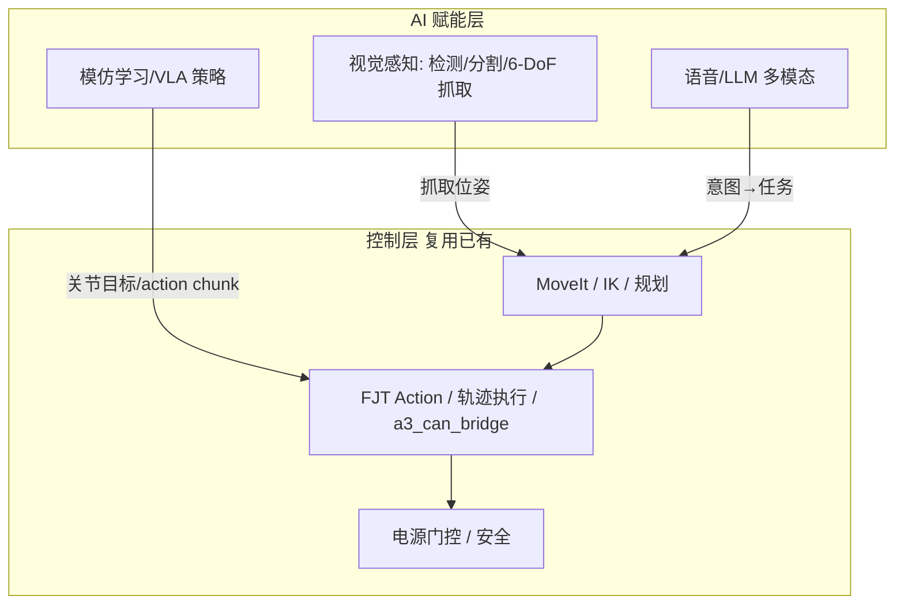
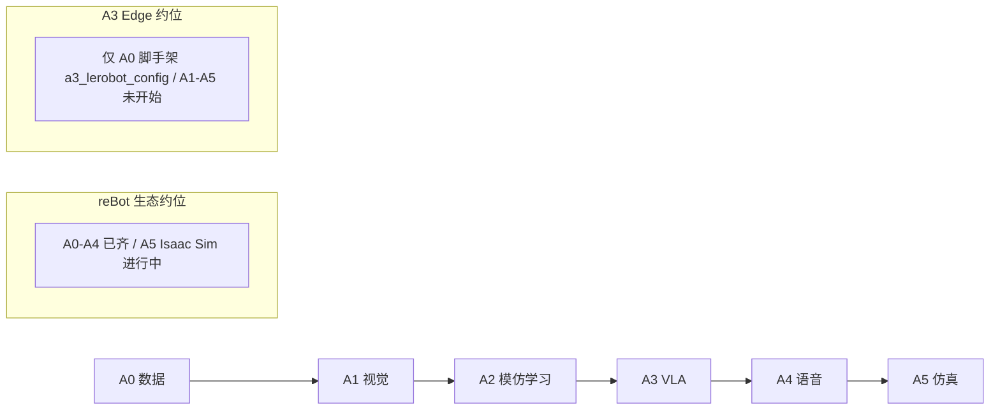
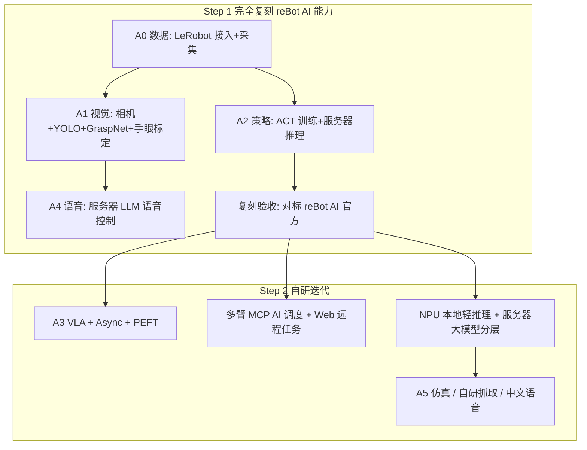

# 机械臂 AI 功能开发路线

> **Status:** draft  
> **范围：** AI 赋能（数据采集、模仿学习 / VLA、视觉抓取、语音多模态、仿真）  
> **不含：** 控制栈（驱动、轨迹、规划、动力学、力控，见 [CONTROL_ROADMAP.md](CONTROL_ROADMAP.md)）  
> **产品线：** 以 [A3 Edge](../edge/ARCHITECTURE.md) 为主线；CloudEdge 交叉引用 [cloud_edge/ROADMAP.md](../cloud_edge/ROADMAP.md)

## 文档用途（给下一步规划用）

本文档是 **A3 具身智能（AI 赋能）能力建设的规划底稿**，不是需求条目本身。用法：

1. **对标：** 用第 4 章矩阵看清与 [reBot-DevArm](https://github.com/Seeed-Projects/reBot-DevArm) 生态在 AI 能力上的差距  
2. **分期：** 用第 5 章 **Step 1（完全复刻 reBot）→ Step 2（自研迭代）** 排实现顺序  
3. **立项：** 每启动一项，先在 [`docs/edge/REQUIREMENTS.md`](../edge/REQUIREMENTS.md) 写需求 ID 与验收，再改 `src/`  
4. **选型：** 第 1、6 章固定「训练放哪、推理放哪、NPU 跑什么、何时上 CloudEdge MCP」等决策，避免实现时反复争论

**近期目标：** 先让 A3 Edge **AI 能力至少对齐 reBot 官方 AI 栈**（LeRobot 数据采集与训练、深度相机视觉抓取、语音控制），再发展结合 CloudEdge 多臂 MCP 与 RK3588 NPU 的自研 AI 能力。

本文档回答：

1. 桌面/协作臂的 AI 赋能通常按什么顺序做（A0–A5）  
2. reBot 生态与 A3 Edge 各自做到哪一步  
3. A3 如何分两步落地（含 Edge / CloudEdge 算力分工、NPU vs 服务器推理策略）

---

## 1. AI 能力全景：训练 vs 推理 vs 感知 vs 交互

### 1.1 职责边界

AI 赋能与控制栈是**分层协作**，不是「AI 替代控制」。AI 输出的是**目标（关节/笛卡尔/夹爪）**，最终仍经控制栈（[CONTROL_ROADMAP.md](CONTROL_ROADMAP.md) 的 L2/L5 执行层）落到电机。

| 组件 | 做什么 | 不做什么 |
|------|--------|----------|
| **视觉感知** | RGB-D 采集、目标检测/分割、手眼标定、6-DoF 抓取姿态估计 | 不直接发 CAN；不替代运动规划 |
| **模仿学习 / VLA 策略** | 从演示数据训练策略，输出动作块（action chunk）驱动机械臂 | 不是控制执行层；输出需经门控/限位 |
| **语音 / LLM** | ASR 转写 → LLM 解析意图 → 调用任务接口 → TTS 播报 | 不接实时闭环；不替代安全停机 |
| **仿真** | Isaac Sim 合成数据、遥操作仿真、策略 S²E 迁移 | 不替代真机标定与验收 |

### 1.2 训练与推理的算力边界（A3 的核心差异）

reBot 官方全程押注 **NVIDIA Jetson（CUDA / TensorRT）**：检测走 TensorRT、4B LLM 走 TensorRT-Edge-LLM、训练走 A100/RTX 4090。A3 Edge 是 **RK3588（6 TOPS NPU / RKNN）**，无 CUDA、无独立 GPU：

| 算力位 | reBot | A3 Edge 选择 |
|--------|-------|--------------|
| 训练（ACT/VLA/GraspNet） | 服务器 A100 / 本地 RTX 4090 | **内网/云 GPU 服务器**（复用 CloudEdge 服务器侧） |
| 大模型推理（4B LLM / VLA） | Jetson TensorRT-Edge-LLM | **服务器**（CloudEdge MCP / async inference cloud 模式） |
| 轻量推理（检测/分割/轻策略） | Jetson TensorRT | **RK3588 NPU（RKNN）**，本地低延迟 |
| 语音 ASR/TTS | Jetson 本地 Qwen3 + MOSS-TTS | 轻量中文 ASR/TTS 本地；LLM 语义走服务器 |

> 结论：**训练与重推理上服务器，NPU 只跑检测/轻量策略**，与 CloudEdge「服务器一套算法多臂共用」天然契合。这是本文第 6 章的固定决策。

### 1.3 AI 输出 ≠ 免安全（沿用 SAFETY）

AI 策略/VLA 输出的动作仍需经过 [SAFETY.md](SAFETY.md) 的软限位、gate、急停、断连看门狗。**禁止 AI 直接写 CAN / 绕过电源门控**；大模型/VLA 推理延迟不可用于 200 Hz 力闭环。语音/LLM 接口必须鉴权（内网），公网不暴露。

---

## 2. AI 能力分层（A0–A5，由数据到智能）

完善桌面/协作臂 AI 赋能的推荐顺序。后一层依赖前一层稳定；A2+ 依赖控制栈 L5 真机闭环稳定。

### A0 — 数据基础与采集

| 项 | 内容 |
|----|------|
| **能力** | LeRobot 接入机器人、电机标定、遥操作采集演示数据（episode）、数据集可视化/回放 |
| **常见组件** | HuggingFace LeRobot、`lerobot-record`/`lerobot-calibrate`/`lerobot-dataset-viz`、遥操作器 |
| **验收** | 稳定采集 ≥50 episode；标定文件可跨机复用；`/joint_states` 与相机帧同步入数据集 |
| **常见坑** | 与 `a3_can_bridge` 抢同一 `can1`；采集期电机未使能；标定缓存未清导致跨机不一致 |

### A1 — 视觉感知

| 项 | 内容 |
|----|------|
| **能力** | RGB-D 深度相机、目标检测/分割、手眼标定（TSAI）、6-DoF 抓取姿态估计 |
| **常见组件** | YOLO/YOLOE（open-vocab）、GraspNet、OBB 最小外接矩形、Orbbec/RealSense 驱动 |
| **验收** | 桌面目标可识别并给出可达抓取位姿；手眼标定后相机系→基座系误差在容差内 |
| **常见坑** | 手眼标定不做就把相机坐标当基座坐标；深度相机走 USB HUB 掉帧 |

### A2 — 模仿学习策略

| 项 | 内容 |
|----|------|
| **能力** | 从 A0 数据集训练端到端策略并部署推理（单任务行为克隆） |
| **常见组件** | ACT、Diffusion Policy、`lerobot-train`、`lerobot-record`（policy 推理） |
| **验收** | 单任务成功率达标；策略输出经 FJT/执行层落地；推理延迟可接受 |
| **常见坑** | 数据集 <50 episode 泛化差；把策略输出直接当整轨目标而非 action chunk |

### A3 — VLA / 基础模型

| 项 | 内容 |
|----|------|
| **能力** | 视觉-语言-动作模型，语言条件任务、跨任务泛化、PEFT 微调、异步推理 |
| **常见组件** | SmolVLA、Pi0/Pi0.5、GR00T N1.5、OpenVLA、LoRA、LeRobot async inference（PolicyServer/RobotClient） |
| **验收** | 自然语言指令驱动任务；async inference 下动作块不空转 |
| **常见坑** | 大 VLA 本地跑不动；async gRPC 未鉴权暴露公网 |

### A4 — 语音 / 多模态交互

| 项 | 内容 |
|----|------|
| **能力** | 语音→意图→任务→语音反馈全链路；唤醒词、DoA 空间感知 |
| **常见组件** | ASR（Whisper/Qwen3）、LLM（Ollama/Qwen3.5）、TTS（MOSS-TTS）、reSpeaker 麦克风阵列、OpenWebUI |
| **验收** | 「抓住桌上的水杯」→ 视觉抓取 → 播报结果，全本地/内网闭环 |
| **常见坑** | LLM 意图未与任务 API 契约对齐；语音接口无鉴权 |

### A5 — 仿真与合成数据

| 项 | 内容 |
|----|------|
| **能力** | Isaac Sim USD 模型、仿真遥操作、合成数据、sim-to-real 迁移 |
| **常见组件** | NVIDIA Isaac Sim、USD、域随机化 |
| **验收** | 仿真内策略可训练并迁移真机 |
| **常见坑** | 仿真物理参数与真机差异过大导致迁移失败 |

---

## 3. reBot AI 功能全清单（Step 1 复刻核对源）

> 来源：reBot-DevArm 官方 README「Roadmap & Status」表 + Seeed Wiki。状态为官方口径（截至 2026-07）。

| # | 功能 | 状态 | 关键组件 / 命令 | 硬件依赖 | 来源 |
|---|------|------|-----------------|----------|------|
| 1 | **LeRobot 端到端集成** | ✅ 完成 | `rebot_b601_follower` / `rebot_b601_rs_follower` robot 类 + `rebot_102_leader` 遥操作器；原生进 HuggingFace LeRobot（commit #3624/#4071） | CAN 电机 + leader arm | [B601-DM LeRobot](https://wiki.seeedstudio.com/rebot_arm_b601_dm_lerobot/) · [B601-RS LeRobot](https://wiki.seeedstudio.com/rebot_arm_b601_rs_lerobot/) |
| 2 | **遥操作采集** | ✅ 完成 | `lerobot-teleoperate`；StarArm102 leader → follower 双臂遥操作 | leader arm（FashionStar UART 舵机） | 同上 |
| 3 | **标定** | ✅ 完成 | `lerobot-calibrate`；follower CAN / leader UART 标定 | — | 同上 |
| 4 | **数据集采集/可视化/回放** | ✅ 完成 | `lerobot-record` / `lerobot-dataset-viz` / `lerobot-replay` | — | 同上 |
| 5 | **策略训练** | ✅ 完成 | `lerobot-train`；`act` / `diffusion` / `sac` / `smolvla` / `pi0` / `pi05` / `groot` | CUDA GPU | 同上 |
| 6 | **VLA 模型** | ✅ 完成 | SmolVLA、Pi0/Pi0.5、GR00T N1.5、OpenVLA；PEFT/LoRA 微调 | CUDA GPU | 同上 |
| 7 | **异步推理（Async Inference）** | ✅ 完成 | `policy_server` + `robot_client`（gRPC）；单机/LAN/云三模式 | GPU（可远程） | [HuggingFace Async](https://huggingface.co/docs/lerobot/main/async) |
| 8 | **视觉抓取（YOLO + 深度相机）** | ✅ 完成 | YOLO/YOLOE 检测分割 + OBB 最小矩形抓取姿态 + TSAI 手眼标定 + `reBotArm_control_py` IK 执行 | RGB-D（Orbbec Gemini2 / RealSense D405/D435i） | [Visual Grasping Demo](https://wiki.seeedstudio.com/rebot_arm_b601_dm_grasping_demo/) |
| 9 | **GraspNet 6-DoF 抓取** | ✅ 完成 | YOLO11n-seg TensorRT 过滤 + GraspNet 6-DoF 姿态 + Web UI/CLI/HTTP API | Jetson（TensorRT） | [GraspNet Visual Grasping](https://wiki.seeedstudio.com/rebot_arm_b601_dm_graspnet_visual_grasping/) |
| 10 | **语音控制（全本地）** | ✅ 完成 | 唤醒词 + Qwen3 流式 ASR + MOSS-TTS-Nano + Qwen3.5-4B（TensorRT-Edge-LLM MTP 投机解码） | Jetson Orin NX | [Voice-Controlled Grasping](https://www.seeed.cc/solutions/reference-designs/voice_rebot_arm) |
| 11 | **语音控制（Whisper + Ollama + OpenWebUI）** | ✅ 完成 | Whisper ASR + Ollama 本地 LLM + OpenWebUI + GraspNet；Robot Arm Tools 桥接 HTTP API | Jetson Thor | [Voice Control](https://wiki.seeedstudio.com/voice_control_rebot_arm/) |
| 12 | **reSpeaker 语音阵列** | ✅ 完成 | reSpeaker Flex 4-mic 阵列 + 空间感知 DoA | reSpeaker 麦克风阵列 | [reSpeaker Voice Control](https://wiki.seeedstudio.com/control_rebot_arm_using_voice_with_respeaker_flex/) |
| 13 | **Isaac Sim 仿真** | 🚧 进行中（DM）/ ⏳ 规划（RS） | USD 模型 + 仿真遥操作 + 合成数据 | NVIDIA GPU | [reBot-Isaacsim](https://github.com/Seeed-Projects/reBot-Isaacsim) |
| 14 | **社区贡献** | ※ 非官方 | 被动诊断 monitor、safe park、gamepad teleop IK/FK、D405 eye-in-hand TF | — | [rebotarm_monitor_ros2](https://github.com/danieldoradotalaveron-rb/rebotarm_monitor_ros2) |

**关键约束（复刻时须注意）：**

- reBot 官方 AI 栈全程绑 **Jetson + CUDA/TensorRT**；A3 RK3588 无此生态，第 1.2 节算力分工不可照抄。
- LeRobot 已原生收录 reBot 的 `rebot_b601_follower`（DM，Damiao CAN 电机）与 `rebot_b601_rs_follower`（RS，Robstride 私有总线）；A3（EL05/RS05 MIT 电机）需**自写 robot 类**，复用 `a3_lerobot_config/config/a3_robot.yaml` 的 7-DOF 关节定义（`L1_joint`..`L7_joint`）。
- leader arm（StarArm102）是 reBot 采集演示数据的遥操作器；A3 无此硬件，可用已有 **PS4 遥操作（F16）** 替代。

---

## 4. 对比矩阵：理想栈 vs reBot vs A3 Edge

### 4.1 成熟度阶梯

| 层级 | 理想完善栈 | reBot-DevArm 生态 | A3 Edge（本仓库） |
|------|------------|-------------------|-------------------|
| A0 数据采集 | ✅ | ✅ LeRobot 原生 robot 类 + leader 遥操作 | ⚠️ `a3_lerobot_config` 脚手架（robot YAML + 集成说明） |
| A1 视觉感知 | ✅ | ✅ YOLO + GraspNet + 手眼标定 | ❌ |
| A2 模仿学习 | ✅ | ✅ ACT/Diffusion 训练 + 部署 | ❌ |
| A3 VLA | ✅ | ✅ SmolVLA/Pi0/GR00T + PEFT + Async | ❌ |
| A4 语音多模态 | ✅ | ✅ 全本地语音栈 / Whisper+Ollama | ❌ |
| A5 仿真 | ✅ | 🚧 Isaac Sim 进行中 | ❌ |

### 4.2 能力明细对照（对齐 checklist）

图例：✅ 已实现 · ⚠️ 部分/脚手架 · ❌ 未实现 · 🔜 路线 · ※ 社区非官方  
**「对齐步次」列：** Step 1 必须复刻 reBot 官方；Step 2 为 A3 自研/超出。

| 能力 | reBot | A3 Edge | 对齐步次 | 对应项 |
|------|-------|---------|----------|--------|
| LeRobot robot 类接入 | ✅ 原生 `rebot_b601_*_follower` | ⚠️ 脚手架 `a3_robot.yaml` | Step 1 | A0 / F21 |
| 电机标定 `lerobot-calibrate` | ✅ | ❌ | Step 1 | A0 |
| 遥操作采集（leader） | ✅ StarArm102 | ✅ 用 PS4（F16）替代 | Step 1 复用 | A0 / F16 |
| 数据集采集/可视化/回放 | ✅ | ❌ | Step 1 | A0 |
| ACT / Diffusion 训练 | ✅ | ❌（服务器可训） | Step 1 | A2 |
| VLA（SmolVLA/Pi0/GR00T） | ✅ | ❌（服务器可训） | Step 2 | A3 |
| PEFT / LoRA 微调 | ✅ | ❌ | Step 2 | A3 |
| Async Inference（PolicyServer/RobotClient） | ✅ | ❌ | Step 1（服务器推理） | A2/A3 |
| 深度相机接入（RGB-D） | ✅ Orbbec/RealSense | ❌ | Step 1 | A1 |
| YOLO 检测/分割 | ✅ TensorRT | ❌（RKNN 待适配） | Step 1 | A1 |
| GraspNet 6-DoF 抓取 | ✅ | ❌ | Step 1 | A1 |
| 手眼标定（TSAI） | ✅ | ❌ | Step 1 | A1 |
| 视觉抓取闭环 | ✅ | ❌ | Step 1 | A1 / C1 |
| 语音 ASR + LLM + TTS | ✅ 全本地 | ❌（服务器 LLM） | Step 1/2 | A4 |
| reSpeaker 阵列 / DoA | ✅ | ❌ | Step 2 可选 | A4 |
| Isaac Sim 仿真 | 🚧 | ❌ | Step 2 可选 | A5 |
| 多臂 AI 调度（MCP） | ※ | 🔜 结合 CloudEdge P3 | Step 2 | CloudEdge S5 |
| Web 远程 AI 任务 | ※ | 🔜 结合 deep-trace | Step 2 | F18/F20 |

**reBot AI 源码不在 DevArm 主仓：**

- LeRobot robot 类已合入 [huggingface/lerobot](https://github.com/huggingface/lerobot)（原生）；Seeed 另维护 [Seeed-Projects/lerobot](https://github.com/Seeed-Projects/lerobot) 稳定 fork
- 视觉抓取：[EclipseaHime017/reBot-DevArm-Grasp](https://github.com/EclipseaHime017/reBot-DevArm-Grasp)
- 控制 SDK（AI 执行后端）：[vectorBH6/reBotArm_control_py](https://github.com/vectorBH6/reBotArm_control_py)
- 语音方案：reSpeaker / Jetson Thor 全本地栈（Seeed 参考设计）

本仓库通过 `a3_lerobot_config` + `trajectory_bridge` + F10 FJT Action 对接 AI 输出；策略 action chunk 经 FJT/轨迹执行层落地，`/joint_states` 50 Hz 作为策略观测输入。

### 4.3 一句话对比

| 项目 | 强项 | 对齐前主要缺口 |
|------|------|----------------|
| **reBot 生态** | AI 全链路（数据→训练→VLA→视觉→语音）官方闭环、Jetson 端到端、原生进 LeRobot | 绑定 Jetson/CUDA；无多臂 MCP 编排；AI 安全护栏弱 |
| **A3 Edge** | 控制栈（C++ 低延迟 CAN + 门控 + 重力补偿 + PS4 遥操作）扎实，已预留 LeRobot 脚手架 + CloudEdge 服务器 + deep-trace Web | AI 全链路从零起步；RK3588 无 CUDA，训练/大模型推理需上服务器 |

---

## 5. 落地路线：先完全复刻 reBot，再自研迭代

落地任一项前：[`docs/edge/REQUIREMENTS.md`](../edge/REQUIREMENTS.md) 追加需求 ID → 必要时更新 [TOPIC_CONTRACT.md](TOPIC_CONTRACT.md) / [SAFETY.md](SAFETY.md) → 再改 `src/`。

### 5.1 两步总览

| 步次 | 目标 | 项 | 建议顺序 |
|------|------|-----|----------|
| **Step 1** | AI 能力 **完全复刻** reBot 官方（A0+A1+A2 核心，A4 服务器版） | A0 → A1 → A2 → A4 | A0 严格先行：无数据则策略/抓取无意义 |
| **Step 2** | A3 自有能力 + 多臂/Web/分层推理 | A3、MCP、NPU 分层、A5 | 可并行选型；A5 依赖硬件/NVIDIA |

### 5.2 Step 1 — 完全复刻 reBot（P0 / P1）

#### A0 — LeRobot 数据采集接入（P0，最先）

| 项 | 内容 |
|----|------|
| **对齐点** | reBot `rebot_b601_*_follower` 原生 LeRobot 接入 + 标定 + 采集 |
| **目标** | 自写 A3 robot 类（7-DOF，`L1_joint`..`L7_joint`），打通标定、采集、可视化、回放 |
| **前置** | 控制 C1/C2（真机轨迹闭环）稳定；`a3_can_bridge` bringup |
| **做法** | 复用 `a3_lerobot_config/config/a3_robot.yaml`；采集经 ROS2 后端话题（勿与 `a3_can_bridge` 抢 `can1`）；PS4（F16）替代 leader arm 做遥操作采集 |
| **主要包** | `a3_lerobot_config`（脚手架→可用） |
| **验收** | 稳定采集 ≥50 episode；标定文件跨机复用；`/joint_states` + 相机帧同步入数据集 |
| **需求 ID 草案** | `F21` LeRobot 数据采集接入（正式编号以 REQUIREMENTS 为准） |

#### A1 — 视觉抓取（P0/P1，依赖深度相机）

| 项 | 内容 |
|----|------|
| **对齐点** | reBot YOLO 检测 + GraspNet 6-DoF 抓取 + TSAI 手眼标定 + RGB-D |
| **目标** | 桌面目标检测→可达抓取位姿→经控制栈抓取闭环 |
| **前置** | A0 完成；采购/接入 RGB-D 相机（Orbbec Gemini2 / RealSense） |
| **做法** | YOLO/YOLOE 适配 RKNN（NPU 本地检测）；GraspNet 抓取姿态与手眼标定可先在服务器跑通，再评估 NPU 落地；抓取执行复用 `reBotArm_control_py` 语义或本仓 IK/FJT |
| **与 reBot** | 对齐 GraspNet Demo / `reBot-DevArm-Grasp` 流程；不照抄 TensorRT |
| **主要包** | 新增视觉包（`a3_vision` 或外置）；`a3_moveit_config` IK |
| **验收** | 指定目标识别并抓取到位；手眼标定误差达标 |
| **需求 ID 草案** | `F22` 深度相机接入 + 视觉抓取 |

#### A2 — 模仿学习策略训练与部署（P0/P1）

| 项 | 内容 |
|----|------|
| **对齐点** | reBot ACT/Diffusion 训练 + `lerobot-record` 推理部署 |
| **目标** | 用 A0 数据集训练 ACT 单任务策略并在真机/仿真执行 |
| **做法** | 训练放**内网/云 GPU 服务器**（复用 CloudEdge 服务器侧）；推理先走 **async inference 服务器模式**（PolicyServer 在服务器，RobotClient 在 RK3588），再评估 NPU 轻策略 |
| **主要包** | `a3_lerobot_config` + 服务器 LeRobot |
| **验收** | 单任务策略推理驱动机械臂到位；action chunk 经 FJT/执行层；延迟可接受 |
| **需求 ID 草案** | `F23` 模仿学习训练 + 推理闭环 |

#### A4 — 语音控制（P1，服务器 LLM 版）

| 项 | 内容 |
|----|------|
| **对齐点** | reBot 语音→LLM 意图→抓取→TTS 反馈 |
| **目标** | 内网语音控制闭环（ASR + LLM + TTS + 任务 API） |
| **做法** | LLM 语义放服务器（Qwen3.5 或 Ollama）；ASR/TTS 先服务器、后评估 RK3588 轻量中文模型；任务接口对接控制栈 + 视觉抓取（复用 CloudEdge MCP S5 语义）；接口鉴权 |
| **主要包** | CloudEdge 服务器侧 MCP + 语音服务 |
| **验收** | 语音指令完成一次抓取闭环并播报；公网不暴露未鉴权接口 |
| **需求 ID 草案** | `F24` 语音多模态控制（服务器侧） |

**Step 1 复刻验收（规划用 DoD）：**

- [ ] A0：LeRobot 采集 ≥50 episode，标定可复现
- [ ] A1：视觉抓取桌面目标闭环
- [ ] A2：ACT 策略训练 + 服务器推理驱动真机
- [ ] A4：语音指令 → 抓取 → 播报全链路
- [ ] 相关需求已写入 `docs/edge/REQUIREMENTS.md`（F21–F24）
- [ ] AI 输出始终经门控/限位（SAFETY 不绕过）

### 5.3 Step 2 — 自研迭代（对齐之后）

#### A3 — VLA 与异步推理（P2）

| 项 | 内容 |
|----|------|
| **目标** | 语言条件 VLA（SmolVLA/Pi0/GR00T）+ PEFT 微调 + async inference 云模式，**超出** reBot 单机 |
| **做法** | 服务器训练 VLA；RK3588 走 async inference 客户端；结合 CloudEdge MCP 做多臂语言任务 |
| **验收** | 自然语言跨任务；async 动作块不空转 |
| **需求 ID 草案** | `F25` VLA + Async 推理 |

#### MCP 多臂 AI 调度 + Web 远程任务（P2）

| 项 | 内容 |
|----|------|
| **目标** | 结合 CloudEdge P3 多臂 MCP，做多臂 AI 任务编排；结合 deep-trace Web（F18/F20）做远程 AI 任务下发与 3D 状态回显 |
| **做法** | CloudEdge MCP 封装 move/grasp/归位等任务级 API；deep-trace 预留 `cmd` 下行接 AI 任务 |
| **验收** | MCP 一次「规划+执行」闭环；Web 下发 AI 任务并回显 |
| **需求 ID 草案** | `F26` 多臂 MCP AI 调度（CloudEdge 侧） |

#### NPU 本地轻推理 + 服务器大模型分层（P2）

| 项 | 内容 |
|----|------|
| **目标** | RK3588 NPU（RKNN）本地跑检测/分割/轻量策略，大模型走服务器，形成分层推理 |
| **做法** | YOLO/YOLOE → RKNN；评估轻量 ACT 策略 NPU 落地；服务器仅处理 VLA/LLM |
| **验收** | 本地检测低延迟；分层后控制闭环延迟可控 |

#### A5 — 仿真 / 自研抓取 / 中文语音（P3+）

| 项 | 内容 |
|----|------|
| **目标** | Isaac Sim 合成数据与 S²E；针对 7-DOF 冗余的自研抓取策略；本地轻量中文 ASR/TTS |
| **做法** | 选型 Isaac Sim（需 NVIDIA GPU 或云）；自研 7-DOF 抓取采样；RK3588 中文轻量语音模型评估 |
| **验收** | 仿真策略迁移真机；自研抓取优于基线；本地中文语音可用 |
| **需求 ID 草案** | `F27` 仿真/自研抓取/中文语音（可选） |

### 5.4 下一步规划怎么用本表

启动实现前建议按此清单开一轮规划（新对话 / 新需求批次）：

1. 确认本轮只做 **Step 1** 还是包含某项 Step 2  
2. 从 A0 起拆任务：改哪些包、是否新增外置视觉包、如何真机验收  
3. 每项先写 REQUIREMENTS，再编码  
4. Step 1 DoD 打勾后再排 A3/MCP 等差异化项

---

## 6. 架构决策备忘

### 6.1 训练 / 推理分工（固定决策）

| 项 | 位置 | 说明 |
|----|------|------|
| 数据采集 | RK3588（本地） | LeRobot robot 类 + PS4 遥操作；低延迟本地闭环 |
| 训练（ACT/VLA/GraspNet） | **内网/云 GPU 服务器** | 复用 CloudEdge 服务器侧；RK3588 无 CUDA |
| 大模型推理（VLA/LLM） | **服务器** | async inference cloud / MCP；公网需鉴权 |
| 轻量推理（检测/分割/轻策略） | **RK3588 NPU（RKNN）** | 本地低延迟，避免网络抖动 |
| 语音 ASR/TTS | 轻量中文本地 / LLM 语义服务器 | 分阶段评估 |

### 6.2 与 CloudEdge 的关系

| 主题 | Edge（本文主线） | CloudEdge |
|------|------------------|-----------|
| 训练 | RK3588 采集，服务器训练 | 服务器训练 + 多臂共用 |
| 推理 | NPU 轻推理 + 服务器重推理 | 服务器 MCP 任务级 AI |
| 多臂 AI | 单臂本地为主 | **多臂 MCP 编排**（P3） |

AI 能力优先在 Edge 验证，再迁移/上收语义到 CloudEdge MCP（多臂共用）。

### 6.3 与 deep-trace 的关系

deep-trace（外部仓库）已打通 F18 MQTT 遥测 + F20 3D 渲染；Step 2 的 Web 远程 AI 任务复用其预留的 `cmd` 下行骨架，AI 任务结果经 MQTT 回显。

### 6.4 安全边界

- AI 策略/VLA 输出仍经 [SAFETY.md](SAFETY.md) 软限位/gate/急停；**禁止 AI 直写 CAN 或绕过门控**
- 大模型/VLA 推理延迟不可用于 200 Hz 力闭环；力控仍走边缘实时环
- 语音/LLM/MCP 接口内网鉴权，公网不暴露
- async inference gRPC 有 pickle 反序列化风险，勿直接暴露公网（VPN/SSH 隧道/安全组限源）

---

## 关联文档

| 文档 | 说明 |
|------|------|
| [CONTROL_ROADMAP.md](CONTROL_ROADMAP.md) | 控制功能路线（L0–L8 / C1–C8）；AI 依赖其 L5 真机闭环 |
| [TOPIC_CONTRACT.md](TOPIC_CONTRACT.md) | 轨迹、关节、门控话题契约（AI 输出接口） |
| [SAFETY.md](SAFETY.md) | 安全原则与力控边界 |
| [ROBOT_MODEL.md](ROBOT_MODEL.md) | 7 关节模型与 CAN ID |
| [edge/ARCHITECTURE.md](../edge/ARCHITECTURE.md) | Edge 运行时分层与数据流 |
| [edge/REQUIREMENTS.md](../edge/REQUIREMENTS.md) | Edge 功能需求（**实现前必更新**） |
| [cloud_edge/ROADMAP.md](../cloud_edge/ROADMAP.md) | CloudEdge 部署形态与 MCP 编排 |
| [文档索引](../README.md) | 全库文档入口 |

## 外部参考

| 来源 | 用途 |
|------|------|
| [reBot-DevArm](https://github.com/Seeed-Projects/reBot-DevArm) | 硬件开源 + AI 生态路线图（Roadmap & Status 表） |
| [reBot B601-DM LeRobot Wiki](https://wiki.seeedstudio.com/rebot_arm_b601_dm_lerobot/) | DM 数据采集/训练教程 |
| [reBot B601-RS LeRobot Wiki](https://wiki.seeedstudio.com/rebot_arm_b601_rs_lerobot/) | RS 数据采集/训练/VLA/Async 教程 |
| [reBot Visual Grasping Demo](https://wiki.seeedstudio.com/rebot_arm_b601_dm_grasping_demo/) | YOLO + OBB + 手眼标定抓取 |
| [GraspNet Visual Grasping](https://wiki.seeedstudio.com/rebot_arm_b601_dm_graspnet_visual_grasping/) | GraspNet 6-DoF + TensorRT |
| [Voice-Controlled Grasping（全本地）](https://www.seeed.cc/solutions/reference-designs/voice_rebot_arm) | Qwen3 ASR + Qwen3.5-4B LLM + MOSS-TTS |
| [Voice Control（Whisper+Ollama）](https://wiki.seeedstudio.com/voice_control_rebot_arm/) | Whisper + Ollama + OpenWebUI |
| [reSpeaker Voice Control](https://wiki.seeedstudio.com/control_rebot_arm_using_voice_with_respeaker_flex/) | 麦克风阵列 + DoA |
| [HuggingFace LeRobot](https://github.com/huggingface/lerobot) | 端到端机器人学习框架 |
| [HuggingFace Async Inference](https://huggingface.co/docs/lerobot/main/async) | 异步推理范式 |
| [reBot-Isaacsim](https://github.com/Seeed-Projects/reBot-Isaacsim) | 仿真与合成数据 |
| [reBot-DevArm-Grasp](https://github.com/EclipseaHime017/reBot-DevArm-Grasp) | 视觉抓取源码 |
| [reBotArm_control_py](https://github.com/vectorBH6/reBotArm_control_py) | AI 执行后端 SDK |
