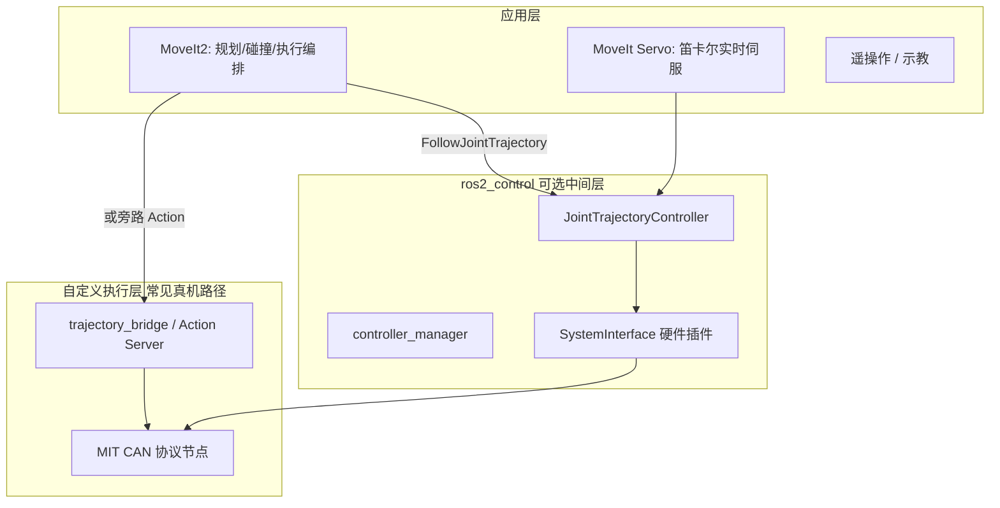
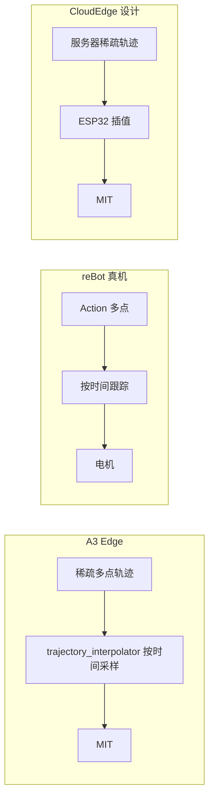
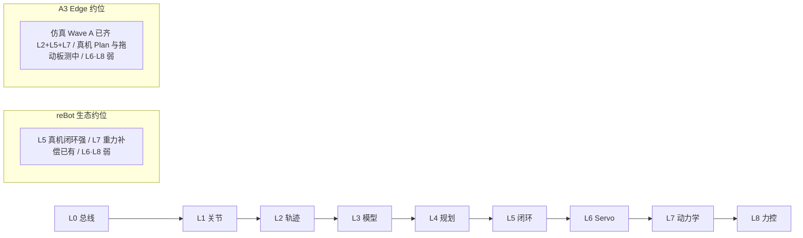
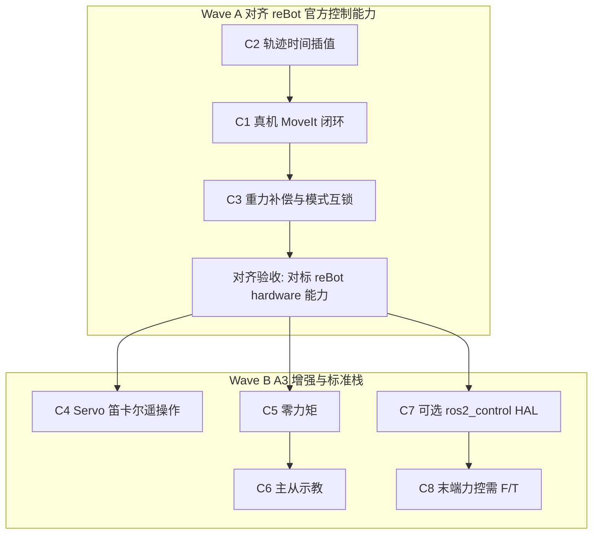

# 机械臂控制功能开发路线

> **Status:** active  
> **范围：** 控制栈（驱动、轨迹、规划、动力学、力控）  
> **不含：** VLA / 视觉抓取 / LeRobot 训练等 AI 赋能（见文末占位）  
> **产品线：** 以 [A3 Edge](../edge/ARCHITECTURE.md) 为主线；CloudEdge 交叉引用 [cloud_edge/ROADMAP.md](../cloud_edge/ROADMAP.md)

## 文档用途（给下一步规划用）

本文档是 **A3 控制能力建设的规划底稿**，不是需求条目本身。用法：

1. **对标：** 用第 3 章矩阵看清与 [reBot-DevArm](https://github.com/Seeed-Projects/reBot-DevArm) 生态的差距  
2. **分期：** 用第 4 章 **Wave A（对齐 reBot）→ Wave B（A3 增强）** 排实现顺序  
3. **立项：** 每启动一项，先在 [`docs/edge/REQUIREMENTS.md`](../edge/REQUIREMENTS.md) 写需求 ID 与验收，再改 `src/`  
4. **选型：** 第 1、5 章固定「插值放哪、IK/动力学用谁、何时上 ros2_control」等决策，避免实现时反复争论

**近期目标：** 先让 A3 Edge **控制能力至少对齐 reBot 官方栈**（真机 Plan+Execute、整轨时间跟踪、重力补偿、模式互锁），再开发 Servo、标准 ros2_control HAL、主从、力控等自有能力。

本文档回答：

1. 完善机械臂控制栈通常按什么顺序做（L0–L8）  
2. reBot 生态与 A3 Edge 各自做到哪一步  
3. A3 如何分波次落地（含 Edge / CloudEdge 插值职责、运动学选型、ros2_control 策略）

---

## 1. 控制栈全景：MoveIt2 vs ros2_control vs 自定义驱动

### 1.1 职责边界

常见误解：「MoveIt2 只有 plan」「ros2_control 才能动真机」。实际三者是**分层协作**，真机也可以**旁路** ros2_control。



| 组件 | 做什么 | 不做什么 |
|------|--------|----------|
| **MoveIt2** | 运动规划（OMPL 等）、碰撞检测、规划场景、`ExecuteTrajectory` / `FollowJointTrajectory` 编排、RViz 交互 | 不直接发 CAN；不替代电机驱动 |
| **ros2_control** | 标准控制器框架：`JointTrajectoryController`、力矩控制器、`hardware_interface` 插件、控制器切换 | 不是 MoveIt 的替代品；没有硬件插件时无法驱动真机 |
| **自定义 MIT 驱动** | SocketCAN / 串口编解码、kp/kd/tau 下发、电源门控、关节状态反馈 | 不做碰撞规划；一般不做笛卡尔力控 |

### 1.2 两条真机路径（reBot 与 A3 均采用）

| 路径 | 典型用途 | 说明 |
|------|----------|------|
| **仿真 / demo** | MoveIt `demo.launch` | `ros2_control` + `mock_components/GenericSystem`；**不驱动真电机** |
| **生产真机** | reBot `hardware.launch` / A3 `a3_bringup` | MoveIt 或遥操作 → Action/话题 → 自定义驱动 → CAN；**常不启动** `ros2_control_node` |

### 1.3 MIT / 电机力矩 ≠ 末端六维力控（L8）

| 信号 | 含义 | 所属层级 |
|------|------|----------|
| **电机力矩反馈** | MIT 回报的 `torque` / `JointState.effort` | L0–L1 状态；L7 重力前馈会用到 |
| **末端六维 F/T** | 腕部/法兰传感器：Fx,Fy,Fz,Mx,My,Mz | **L8** 笛卡尔阻抗/导纳、接触任务 |

电机 **MIT 模式**（位置/速度/kp/kd/力矩前馈）是关节层阻抗式控制：

- **是**：低层执行与重力力矩前馈的载体  
- **不是**：基于末端六维力的柔顺力控；把 kp/kd 调软 ≠ L8  

安全边界见 [SAFETY.md](SAFETY.md)（含「禁止云端 200 Hz 闭环力控」）。

### 1.4 ros2_control 怎么用、优势在哪

`ros2_control` 是**控制器与硬件之间的标准抽象**，不是「必须装才能动臂」。

```text
MoveIt / Servo / 应用
        ↓  标准接口（FollowJointTrajectory 等）
controller_manager   ← 可切换、可抢占多种控制器
  · JointTrajectoryController
  · forward_command / Servo 用接口
  · admittance（有 F/T 后）
        ↓  position / velocity / effort interfaces
SystemInterface 插件  ← 唯一碰 CAN/MIT 的地方
  read() 填状态 / write() 发指令
```

**三种用法：**

| 用法 | 谁在用 | 说明 |
|------|--------|------|
| 仿真 mock | reBot demo、A3 demo | `GenericSystem`；验证规划链路 |
| 真机 HAL（标准栈） | 多数工业 ROS 臂 | 自写插件；JTC/Servo/导纳挂同一套接口 |
| 真机旁路 | **reBot 官方真机、A3 生产** | Action/话题 → 自研驱动；不启 `ros2_control_node` |

**「切换控制器方便」的含义：** 同一硬件接口上，可在轨迹跟踪 / Servo / 导纳 / 零力矩之间 activate/deactivate，而不必为每种模式再写一套「订阅话题 → 发 CAN」节点。换电机时主要改插件，上层配置可大体保留。

**A3 策略（规划约束）：**

- **短期（Wave A）：** 继续旁路，对齐 reBot 真机模式（C2→C1→C3）  
- **中期（Wave B）：** 明确想走标准栈时做 C7 真机 HAL，再顺畅接 Servo/官方导纳  
- 不要「为抽象而抽象」先拆掉已工作的 `a3_can_bridge`

---

## 2. 分层功能路线（L0–L8，由简到繁）

完善桌面/协作臂控制栈的推荐顺序。后一层依赖前一层稳定。

### L0 — 硬件与总线

| 项 | 内容 |
|----|------|
| **能力** | CAN/USB 链路、MIT 帧编解码、单电机使能与反馈解析 |
| **常见组件** | SocketCAN、`cansend`、MotorBridge、板级 overlay |
| **验收** | 指定 ID 电机可 enable；反馈角度/力矩可读；与另一套工具不抢总线 |
| **常见坑** | MotorBridge 与自研驱动同时占 `can0`；WSL2 无法调试板载 SocketCAN |

### L1 — 关节级运动

| 项 | 内容 |
|----|------|
| **能力** | 多关节位置/速度指令、`/joint_states` 发布、电源序列与轨迹门控 |
| **常见组件** | 电源节点、关节映射表、软限位 |
| **验收** | gate 打开后可点动；gate 关闭时拒绝运动；shutdown 后电机 disable |
| **常见坑** | 无门控直接发轨迹；软限位只写在 MoveIt 而未在执行层落地 |

### L2 — 轨迹执行与时间插值（重点）

| 项 | 内容 |
|----|------|
| **能力** | 订阅 `trajectory_msgs/JointTrajectory`；**按 `time_from_start` 跟踪整条轨迹**；可选 `FollowJointTrajectory` Action |
| **常见组件** | JTC、自研插值节点、或边缘固件插值；200 Hz 级 CAN 限流 |
| **验收** | 多点轨迹按时平滑完成；超速/超限被钳位或拒绝 |
| **常见坑** | 只取 `points.front()`；把 CAN 发送频率当成「已插值」 |

#### 插值在干什么

MoveIt 规划出的通常是**稀疏航点**（数秒路径只有几十个点）。电机需要**稠密目标**（约 100–200 Hz）。插值 = 在相邻航点间按时间算出当前关节目标，再高频下发。

```text
规划输出：  t=0 ──●──●──●──●──●── t=2s     （稀疏）
插值之后：  t=0 ················ t=2s     （约每 5ms 一个目标）
再发 CAN：  MIT(q*, kp, kd, …)
```

#### Edge vs CloudEdge：插值放在哪

| 产品线 | 规划端 | 谁做时间插值 | 说明 |
|--------|--------|--------------|------|
| **A3 Edge** | 板载 MoveIt / 本地节点 | **必须在 RK3588 执行层**（C2） | 无 ESP32；稀疏轨迹进板 → 板端插值 → SocketCAN |
| **A3 CloudEdge** | 内网服务器 | **ESP32 本地**（[ROADMAP](../cloud_edge/ROADMAP.md) P2） | 服务器下发**稀疏**轨迹即可；**不要**在云端做 200 Hz 稠密插值再经 WiFi 灌下来 |

CloudEdge mock（`a3_cloud_edge`）已按「收稀疏轨迹 + 本地按时间插值」实现，与真机固件目标语义一致。

#### A3 Edge 现状 vs reBot

| | A3 Edge 生产 | reBot 真机 | reBot 仿真 |
|--|--------------|------------|------------|
| 入口 | 话题 → `motor_protocol_node` | `FollowJointTrajectory` Action | ros2_control JTC |
| 多点时间跟踪 | ✅ `trajectory_interpolator` 按 `time_from_start` 采样 | ✅ 驱动内按时间推进 | ✅ JTC 样条插值 |
| 证据 | [`trajectory_interpolator.hpp`](../../src/a3_can_bridge/include/a3_can_bridge/trajectory_interpolator.hpp) + `OnTrajectory` | `HardwareManager` / Action | `joint_trajectory_controller` |



**规划含义（已落地）：** C2 整轨时间跟踪是对齐 reBot 的硬前置——没有它，C1 真机 MoveIt Execute 也无法正确跑多点规划结果。CAN「200 Hz」仅是发送限流，**不等于**已做轨迹插值。仿真验收：`./scripts/verify_wave_a_sim.sh`。

### L3 — 模型与运动学（MoveIt IK vs Pinocchio）

| 项 | 内容 |
|----|------|
| **能力** | URDF/xacro、TF 树、正/逆运动学；为 L7 准备惯量参数 |
| **常见组件** | `robot_state_publisher`、MoveIt kinematics、Pinocchio、SRDF |
| **验收** | RViz 模型与真机姿态一致；规划 IK 有解；惯量可供重力补偿 |
| **常见坑** | 把「有 URDF」当成动力学已就绪；夹爪 ACM 未配置 |

#### 选型结论（规划约束）：两者一起用，不要二选一

| | MoveIt kinematics（KDL / TRAC-IK 等） | Pinocchio |
|--|--------------------------------------|-----------|
| **强项** | 规划 IK、与 `move_group`/碰撞场景一体 | **动力学**（重力、惯性、科氏）；也可 FK/IK |
| **A3 用途** | L4–L5 规划、RViz、笛卡尔目标 | L7 重力补偿、力矩前馈、拖动示教 |
| **现状** | MoveIt 配置已有 | `inertia_params.yaml` + vendor；生产默认未开 |

reBot 同样是：**MoveIt 做规划 IK + Pinocchio 做重力补偿**。A3 对齐时应保持同一分工。

### L4 — 运动规划

| 项 | 内容 |
|----|------|
| **能力** | MoveIt2 OMPL 规划、碰撞场景、RViz MotionPlanning |
| **常见组件** | `move_group`、`moveit_configs`、规划场景物体 |
| **验收** | demo 可 Plan；自碰/场景碰撞可避免 |
| **常见坑** | 以为 Plan 成功就等于真机动了（mock 路径不发 CAN） |

### L5 — 规划执行闭环

| 项 | 内容 |
|----|------|
| **能力** | Plan + Execute 真机贯通；应用 demo（画方、抓取放置） |
| **常见组件** | MoveIt `ExecuteTrajectory` → 真机 Action/话题；`joint_states` 回传 |
| **验收** | RViz 一次 Plan & Execute 真机到位；状态反馈与规划一致 |
| **常见坑** | `robot.launch` 仍挂 mock；生产 bringup 未启 `move_group` |
| **对齐 reBot** | reBot 已有 `hardware.launch`；A3 对应 **C1**（依赖 C2） |

### L6 — 实时笛卡尔控制

| 项 | 内容 |
|----|------|
| **能力** | MoveIt Servo、手柄/键盘笛卡尔速度控制 |
| **常见组件** | `moveit_servo`、`joy` / teleop |
| **验收** | 连续笛卡尔运动；奇异附近可降速或停 |
| **常见坑** | 配置存在但未接入 launch；与轨迹模式未仲裁 |
| **规划位置** | reBot 官方亦弱；属 A3 **Wave B** 差异化（C4），可在对齐后再做 |

### L7 — 动力学与示教

| 项 | 内容 |
|----|------|
| **能力** | Pinocchio 重力补偿、零力矩/拖动、主从示教 |
| **常见组件** | 动力学库、MIT 力矩前馈、状态机（轨迹 vs 重力补偿互斥） |
| **验收** | 悬停无明显下坠；拖动自由；退出无猛烈冲击（建议 MIT ramp-out） |
| **常见坑** | 模式切换冲击；惯性未标定 |
| **对齐 reBot** | 重力补偿服务 = Wave A **C3**；零力矩/主从 = Wave B **C5/C6** |

### L8 — 力控与柔顺（可选 / 硬件依赖）

| 项 | 内容 |
|----|------|
| **能力** | **末端六维 F/T**、笛卡尔阻抗或导纳、接触装配 |
| **常见组件** | F/T 驱动、`admittance_controller`（ros2_control）或自研力环 |
| **验收** | 接触力可限幅；断传感器时安全停机 |
| **前置** | 必须有腕部/法兰 F/T 硬件；实时环在边缘（见 [SAFETY.md](SAFETY.md)） |
| **常见坑** | 把电机 `effort` 或 MIT 调软当成 L8；云端闭环替代板端力环 |

**电机力矩反馈 ≠ L8。** A3 / reBot 当前均无完整 L8；属 Wave B 之后、依赖硬件采购的增强项（C8）。

---

## 3. 功能对比矩阵：理想栈 vs reBot vs A3 Edge

### 3.1 成熟度阶梯



| 层级 | 理想完善栈 | reBot-DevArm 生态 | A3 Edge（本仓库） |
|------|------------|-------------------|-------------------|
| L0 总线 | ✅ | ✅ MotorBridge / CAN | ✅ `a3_can_bridge` SocketCAN |
| L1 关节+门控 | ✅ | ✅ enable/disable | ✅ 电源序列 + PS4 |
| L2 轨迹插值 | ✅ | ✅ 驱动内整轨执行 | ✅ `motor_protocol` 时间插值（仿真+生产代码） |
| L3 模型/FK·IK | ✅ | ✅ MoveIt IK + Pinocchio 动力学 | ✅ MoveIt kinematics + **Pinocchio `g(q)`** |
| L4 规划 | ✅ | ✅ MoveIt demo | ✅ MoveIt demo（mock） |
| L5 真机 Plan+Execute | ✅ | ✅ `hardware.launch` | ✅ 仿真 `zero→work`；真机统一 launch 板测中 |
| L6 Servo | ✅ | ❌ | ❌ 仅有未集成配置 |
| L7 重力补偿/示教 | ✅ | ✅ Pinocchio 服务 | ✅ 仿真 Pinocchio + 模式互锁；真机拖动板测中 |
| L8 力控柔顺 | ✅（末端 F/T） | ❌ | ❌ |

### 3.2 能力明细对照（对齐 checklist）

图例：✅ 已实现 · ⚠️ 部分/配置残留 · ❌ 未实现 · 🔜 路线 · ※ 社区非官方  
**「对齐」列：** Wave A 必须追平 reBot 官方；Wave B 为 A3 自研/超出。

| 能力 | reBot | A3 Edge | 对齐波次 | 对应项 |
|------|-------|---------|----------|--------|
| MIT 真机执行 | ✅ | ✅ | — 已齐 | — |
| 电源门控 / 安全启停 | ✅ | ✅ | — 已齐 | — |
| 轨迹时间插值 / 整轨跟踪 | ✅ | ✅ | Wave A **已齐（仿真+代码）** | C2 / F6 |
| `FollowJointTrajectory` 或等价 | ✅ Action | ✅ Action Server + 话题桥 | Wave B **F10** | C1 |
| MoveIt Plan（mock） | ✅ | ✅ | — 已齐 | — |
| MoveIt Execute / zero→work | ✅ | ✅ 仿真 | Wave A **仿真已齐**；统一 launch **F11** | C1 / F7/F11 |
| 重力补偿服务 | ✅ | ✅ `/a3/gravity_compensation/*` | Wave A **仿真已齐** | C3 / F8 |
| Pinocchio 全关节 `g(q)` | ✅ | ✅ | Wave A **已齐** | C3 |
| 轨迹↔重力模式互锁 | ✅ | ✅ `/a3/control_mode` | Wave A **仿真已齐**；扩展 ZERO_TORQUE/SERVO | C3/C5/C4 |
| 应用 demo（画方/抓取级） | ✅ | ⚠️ 画矩形 demo | Wave B **F11** | C1 |
| ros2_control 仿真 | ✅ | ✅ | — 已齐 | — |
| ros2_control 真机 HAL | ❌ | ❌ | Wave B 可选 | C7 |
| MoveIt Servo | ❌ | ✅ F14 launch | Wave B | C4 |
| PS4 / 关节 jog | ※ | ✅ | A3 已超 | — |
| 零力矩明确模式 | ⚠️ | ✅ F13 | Wave B | C5 |
| 笛卡尔 MoveToPose/IK | ✅ | ✅ F12 | Wave B | C1 |
| 样条插值（JTC 语义） | ✅ JTC | ✅ F15 | Wave B / C2 增强 | F15 |
| 主从示教 | 🔜 | ❌ | Wave B | C6 |
| 末端六维力 / 导纳 | ❌ | ❌ | 硬件后 | C8 |
| 诊断 / Safe Park | ※ | ❌ | Wave B 可选 | 参考社区 |
| LeRobot / AI | ✅ 另栈 | 🔜 脚手架 | 控制后 | 第 7 章 |

**reBot 控制源码不在 DevArm 主仓：**

- [reBotArmController_ROS2](https://github.com/Seeed-Projects/reBotArmController_ROS2)
- [reBotArm_control_py](https://github.com/vectorBH6/reBotArm_control_py)（及 Seeed 同名仓库）

本仓库通过 `a3_arm_vendor` / `trajectory_bridge` 对接 reBot 壳层话题；**F10** 补齐 `/arm_controller/follow_joint_trajectory` Action（话题桥 alone 不足以支撑 MoveIt Execute）。

**话题桥 vs Action：** `trajectory_bridge` 只转发 `JointTrajectory` 话题；MoveIt 默认需要 FJT Action Server 的 goal/feedback/result。统一真机体验还需 **F11** `edge_moveit_execute.launch`（move_group + 执行层同图），对标 reBot `hardware.launch`。

### 3.3 一句话对比

| 项目 | 强项 | 对齐前主要缺口 |
|------|------|----------------|
| **reBot 生态** | 真机 MoveIt 闭环、重力补偿、双机型 SDK、demo | Servo、力控、官方真机遥操作、ros2_control 真机 HAL |
| **A3 Edge** | C++ 低延迟 CAN、电源门控、PS4、**仿真 Wave A（插值+Pinocchio 重力）** | 真机 MoveIt 统一 launch、真机重力拖动入环、画方级 demo |

---

## 4. A3 落地路线：先对齐 reBot，再自研增强

落地任一项前：[`docs/edge/REQUIREMENTS.md`](../edge/REQUIREMENTS.md) 追加需求 ID → 必要时更新 [TOPIC_CONTRACT.md](TOPIC_CONTRACT.md) / [SAFETY.md](SAFETY.md) → 再改 `src/`。

### 4.1 两波次总览



| 波次 | 目标 | 项 | 建议顺序 |
|------|------|-----|----------|
| **Wave A** | 控制能力 **至少对齐** reBot 官方（L2+L5+L7 核心） | C2 → C1 → C3 | 严格串行：无插值则 Execute 无意义 |
| **Wave B** | A3 自有能力 + 可选标准 ros2_control | C4、C5→C6、C7、C8 | 可并行选型；C8 依赖硬件 |

### 4.2 Wave A — 对齐 reBot（P0 / P1）

#### C2 — 轨迹时间插值（P0，最先）

| 项 | 内容 |
|----|------|
| **对齐点** | reBot 真机「整轨按时间执行」；CloudEdge ESP32 插值语义 |
| **目标** | 多点 `JointTrajectory` 按 `time_from_start` 插值，向 CAN 平滑下发（约 200 Hz 采样，受现有限流约束） |
| **做法** | `trajectory_interpolator.hpp`：JTC 兼容 **auto 样条**（仅 pos→线性；+v→三次；+a→五次；effort 线性）；参数可强制 `linear` |
| **与 reBot** | 采样语义对齐 `joint_trajectory_controller` spline；仍由 `motor_protocol` 执行（不嵌完整 JTC 节点） |
| **Edge / CloudEdge** | Edge：板端必须做。CloudEdge：mock/ESP32 对齐同一采样规则；服务器保持稀疏下发 |
| **主要包** | `a3_can_bridge` |
| **验收** | 多点轨迹无首点阶跃；时长与 `time_from_start` 一致；gate 关闭仍拒绝 |
| **下一步规划提示** | 需求建议 ID 草案：`F6` 轨迹时间跟踪（正式编号以 REQUIREMENTS 为准） |

#### C1 — 真机 MoveIt Plan + Execute（P0）

| 项 | 内容 |
|----|------|
| **对齐点** | reBot `hardware.launch.py` + Execute |
| **目标** | RViz / `move_group` 规划结果在 `a3_bringup` 真机执行 |
| **前置** | **C2 完成**（否则多点规划仍错误） |
| **做法** | MoveIt 控制器指向真机 Action/话题；对齐 `trajectory_bridge`；**不必**先上 ros2_control HAL |
| **主要包** | `a3_moveit_config`、`a3_bringup`、`a3_can_bridge` |
| **可复用** | reBot `moveit_hardware_controllers.yaml`、Execute 路径 |
| **需自研** | bringup + move_group 统一 launch 与 remap |
| **验收** | 真机 Plan & Execute 到位；可选：画方/简单抓取级 demo 与 reBot demo 同级 |

#### C3 — 重力补偿 / 拖动示教与模式互锁（P1）

| 项 | 内容 |
|----|------|
| **对齐点** | reBot `/gravity_compensation/start|stop` + Pinocchio `g(q)` + 状态机互斥 |
| **目标** | 全关节重力力矩；可启停；与轨迹模式互斥；真机再 MIT 前馈拖动 |
| **做法（已落地仿真）** | `gravity_torque_node`：Pinocchio URDF 动力学；话题 `/a3/gravity_torque`；模式 `/a3/control_mode` |
| **真机入环（已接线）** | `motor_protocol`：`enable_gravity_compensation`；`τ_mit = scale × joint_signs × τ_g_urdf`（EDULITE 单次方向） |
| **真机待办** | 退出 ramp-out；板测标定 `gravity_ff_scale` / `gravity_joint_scale`；拖动示教 |
| **验收（仿真）** | `./scripts/verify_wave_a_sim.sh`：backend=pinocchio；L4 等非主导关节亦有有限力矩 |

**Wave A 对齐验收（规划用 DoD）：**

- [x] 多点轨迹时间跟踪（`sim_executor` / `motor_protocol` 插值）
- [x] 仿真 launch 完成 `zero`→`work`（Edge + 双 domain）
- [x] **Pinocchio 全关节**重力力矩可启停；`/a3/control_mode` 与轨迹互锁
- [x] 相关需求已写入 `docs/edge/REQUIREMENTS.md`（F6–F9）
- [x] `motor_protocol` 订阅重力力矩并按 `joint_signs` 写入 MIT `tau`（配置开关）
- [ ] 真机 CAN：重力 MIT 前馈拖动与标定（板测）
- [ ] 真机 MoveIt Plan&Execute 统一 launch（板测）

仿真报告与复跑：[dev/WAVE_A_SIM_TEST_REPORT.md](../dev/WAVE_A_SIM_TEST_REPORT.md) · `./scripts/verify_wave_a_sim.sh`

**依赖：** `sudo apt install -y ros-humble-pinocchio`（Python：`import pinocchio`，需先 `source /opt/ros/humble/setup.bash`）。

### 4.3 Wave B — A3 增强（对齐之后）

#### C4 — MoveIt Servo + 笛卡尔遥操作（P1）

| 项 | 内容 |
|----|------|
| **目标** | 实时笛卡尔速度（手柄/键盘）；**超出** reBot 官方现状 |
| **做法** | 集成 [`servo_config.yaml`](../../src/a3_moveit_config/config/servo_config.yaml)；与轨迹/重力模式仲裁 |
| **与 ros2_control** | 旁路期可用「Servo 输出 → 话题」桥；C7 后可挂标准接口 |
| **验收** | 连续笛卡尔运动；可回安全态 |

#### C5 — 零力矩控制器（P2）

| 项 | 内容 |
|----|------|
| **目标** | 明确零力矩/拖动模式（不仅是重力补偿） |
| **做法** | 实现 YAML 中的 `ZeroTorqueController` 或 C++ 等价模式（可不先进 ros2_control） |
| **验收** | 模式可脚本切换；与 C3 状态机一致 |

#### C6 — 主从示教（P2）

| 项 | 内容 |
|----|------|
| **目标** | Leader → Follower 映射（reBot Leader 仍多为规划中） |
| **做法** | 落地 [`master_slave_config.yaml`](../../src/a3_description/config/master_slave_config.yaml)；依赖 C3/C5 |
| **验收** | 主拖从跟；断连符合 SAFETY |

#### C7 — ros2_control 真机 HAL（P3，标准栈升级）

| 项 | 内容 |
|----|------|
| **目标** | `SystemInterface` 统一仿真/真机；发挥「换控制器、底层只换驱动」优势 |
| **做法** | 将 `a3_can_bridge` 能力迁入或封装为插件；替换 [`el_a3_ros2_control.xacro`](../../src/a3_description/urdf/el_a3_ros2_control.xacro) 中真机仍用 mock 的现状 |
| **何时做** | Wave A 稳定后；且团队确认要长期跟官方 Servo/导纳控制器 |
| **验收** | `use_mock_hardware:=false` 真机 JTC 跑通；延迟满足 Edge &lt; 10 ms |

#### C8 — 末端力控 / 柔顺（P4+）

| 项 | 内容 |
|----|------|
| **目标** | 基于**末端六维 F/T** 的接触任务（非电机 effort） |
| **做法** | 选型传感器 → 更新 SAFETY → Edge 本地力环；禁止仅云端 200 Hz 力闭环 |
| **验收** | 力限幅、传感器失效安全；需求入库 |

### 4.4 下一步规划怎么用本表

启动实现前建议按此清单开一轮规划（新对话 / 新需求批次）：

1. 确认本轮只做 **Wave A** 还是包含某项 Wave B  
2. 从 C2 起拆任务：改哪些包、话题契约是否变、如何真机验收  
3. 每项先写 REQUIREMENTS，再编码  
4. Wave A DoD 打勾后再排 C4/C7 等差异化项  

---

## 5. 架构决策备忘

### 5.1 双路径架构

详见 [edge/ARCHITECTURE.md](../edge/ARCHITECTURE.md)。

| 路径 | Launch | 作用 |
|------|--------|------|
| 生产 | `a3_bringup.launch.py` | `a3_can_bridge` + 可选 PS4；真机 CAN |
| MoveIt/mock | `a3_moveit_config` demo / robot | 规划与仿真；当前真机硬件插件仍为 mock |

**C1：** MoveIt 驱动现有话题/MIT 层。**C7：** 可选收敛到 ros2_control 真机 HAL。

### 5.2 C++ 执行层 vs Python 动力学

| 层 | A3 选择 | reBot 选择 |
|----|---------|------------|
| 实时 CAN 执行 | C++ `a3_can_bridge`（板内低延迟） | Python `HardwareManager` |
| 重力/动力学 | 可 Python 计算 + C++ 力矩前馈 | Pinocchio 在 Python 控制环内 |

Edge 非功能目标：板内控制环延迟 &lt; 10 ms（见 edge REQUIREMENTS）。

### 5.3 与 CloudEdge 的关系

| 主题 | Edge（本文主线） | CloudEdge |
|------|------------------|-----------|
| 轨迹插值 | **C2 板端必须做** | 服务器稀疏下发；**P2 ESP32 插值** |
| 重力补偿 | C3 板载闭环 | 服务器开环 effort + 边缘执行（[SAFETY](SAFETY.md)） |
| 力控 | C8 仅边缘实时环 | **禁止**云端替代边缘力环 |

控制功能优先在 Edge 验证，再移植语义到 CloudEdge 固件。

### 5.4 话题与安全契约

- 轨迹 / 关节 / 门控：[TOPIC_CONTRACT.md](TOPIC_CONTRACT.md)  
- 门控、急停、断连、力控边界：[SAFETY.md](SAFETY.md)

---

## 6. 下一阶段：AI 赋能（占位）

**控制 Wave A（至少 C2–C3）验收后再展开。** 不在本文展开：

| 方向 | 现状 | 说明 |
|------|------|------|
| LeRobot 数据采集 / 训练 | 脚手架 | [`a3_lerobot_config/docs/INTEGRATION.md`](../../src/a3_lerobot_config/docs/INTEGRATION.md) |
| 视觉抓取 / 深度相机 | 未纳入 Edge 主线需求 | reBot Wiki 有 demo 可参考 |
| VLA / 端到端策略 | 未开始 | 依赖稳定轨迹接口与数据管线 |
| MCP 任务编排 | CloudEdge 规划 | 见 cloud_edge REQUIREMENTS / ROADMAP |

建议单独文档（例如 `docs/shared/AI_ROADMAP.md`）在控制对齐后再写。

---

## 关联文档

| 文档 | 说明 |
|------|------|
| [TOPIC_CONTRACT.md](TOPIC_CONTRACT.md) | 轨迹、关节、门控话题契约 |
| [SAFETY.md](SAFETY.md) | 安全原则与力控边界 |
| [ROBOT_MODEL.md](ROBOT_MODEL.md) | 7 关节模型与 CAN ID |
| [edge/ARCHITECTURE.md](../edge/ARCHITECTURE.md) | Edge 运行时分层与数据流 |
| [edge/REQUIREMENTS.md](../edge/REQUIREMENTS.md) | Edge 功能需求（**实现前必更新**） |
| [cloud_edge/ROADMAP.md](../cloud_edge/ROADMAP.md) | CloudEdge 部署形态与 ESP32 插值 |
| [文档索引](../README.md) | 全库文档入口 |

## 外部参考

| 来源 | 用途 |
|------|------|
| [reBot-DevArm](https://github.com/Seeed-Projects/reBot-DevArm) | 硬件开源与生态路线图 |
| [reBotArmController_ROS2](https://github.com/Seeed-Projects/reBotArmController_ROS2) | MoveIt 真机、重力补偿、驱动 API |
| [Seeed Wiki: ROS2 Integration](https://wiki.seeedstudio.com/rebot_arm_b601_dm_ros2_integration/) | reBot ROS2 使用说明 |
| 社区 fork（Daniel Dorado 等） | safe park、monitor、gamepad teleop（※ 非官方主线） |
